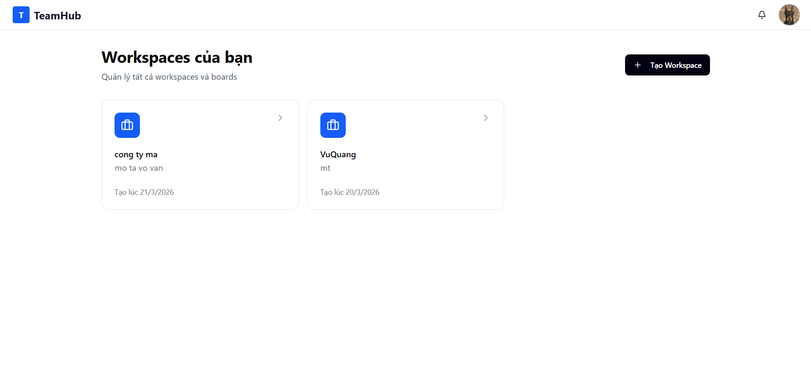
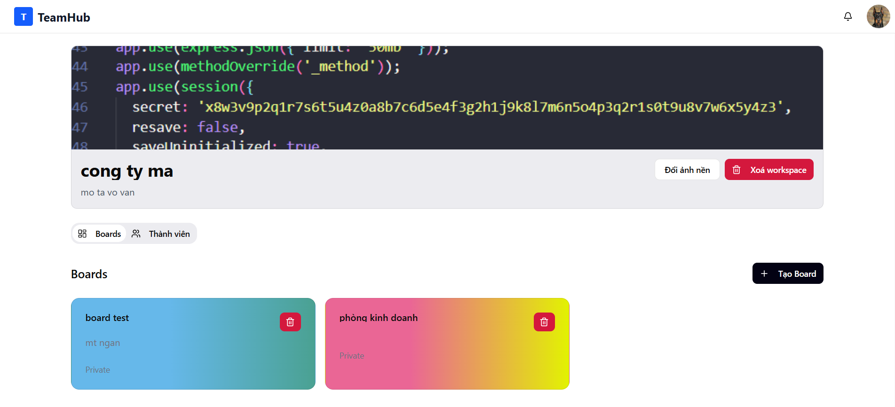
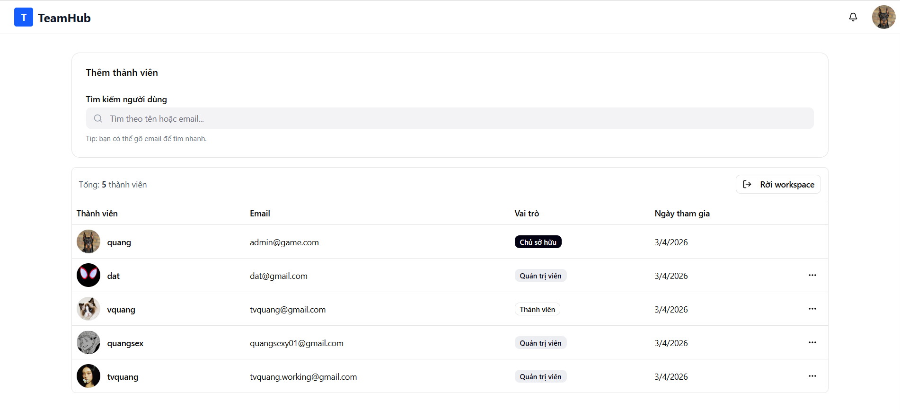
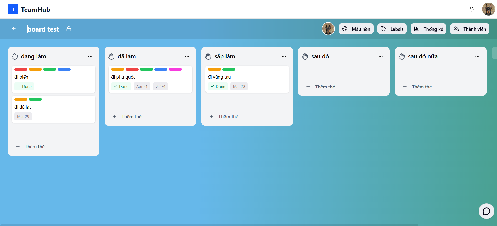
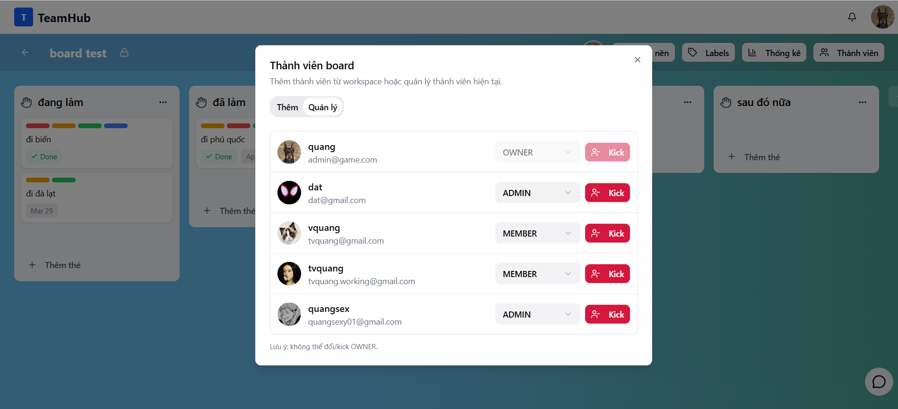
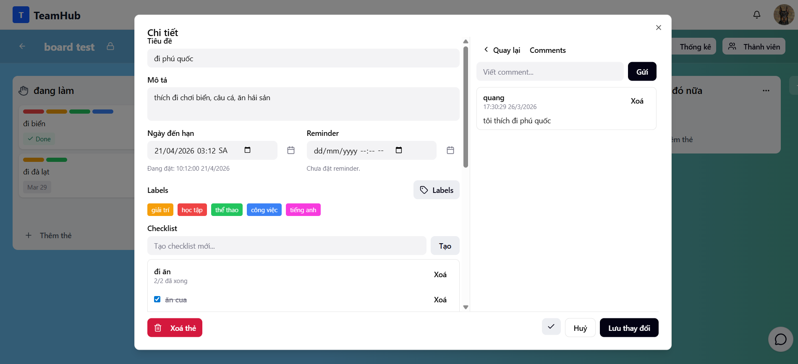
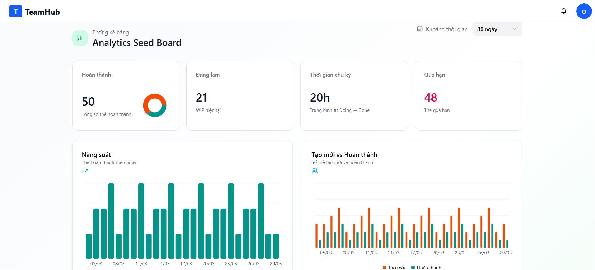
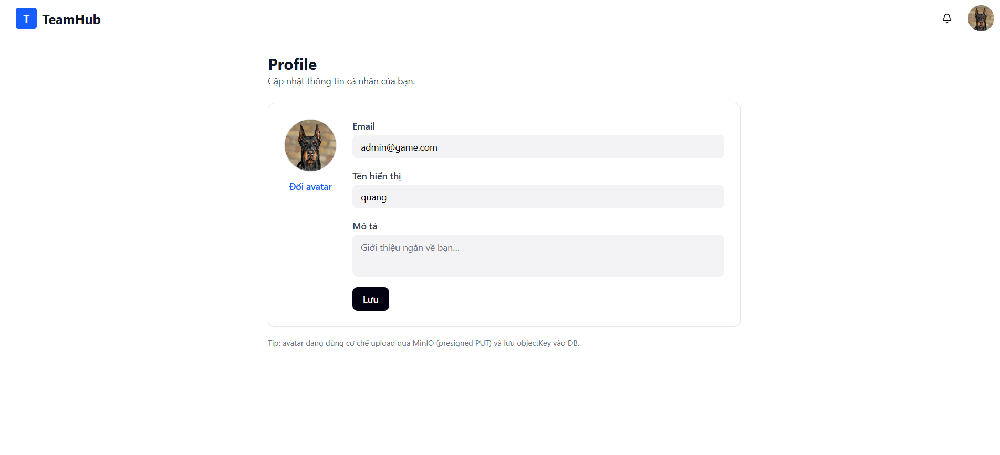
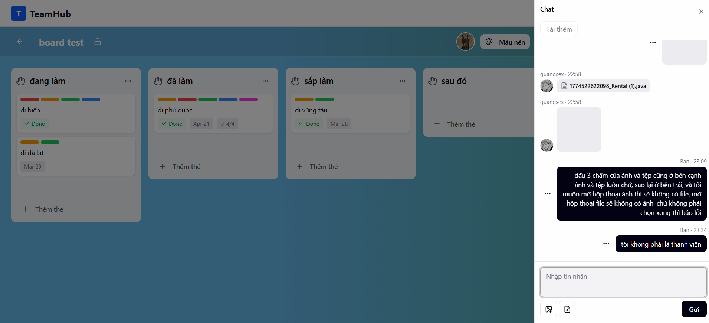
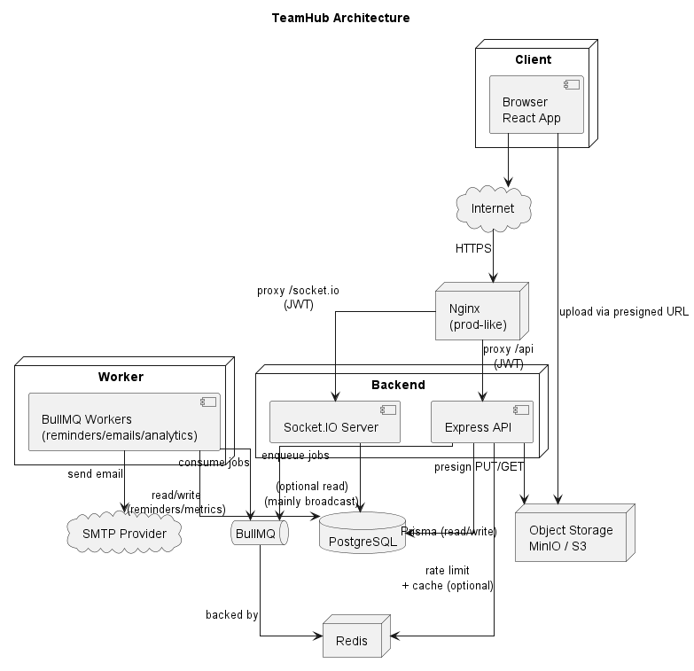

# TeamHub

TeamHub là đồ án xây dựng ứng dụng quản lý công việc theo mô hình **Trello / Kanban** (Workspace → Board → List → Card), hỗ trợ **realtime sync** (Socket.IO), **chat theo board**, **email reminders** chạy nền (BullMQ + Worker), **analytics**, và **upload attachments** qua **presigned URL** (MinIO/S3).

---

## 1) Giới thiệu đồ án

Mục tiêu của TeamHub là mô phỏng một hệ thống quản lý công việc nhiều người dùng:
- Tổ chức theo workspace/board, phân quyền theo role
- Kanban drag-drop reorder/move (tối ưu bằng chiến lược position float)
- Đồng bộ realtime để nhiều client thấy thay đổi ngay lập tức
- Tách các tác vụ gửi mail, rollup analytics, dọn blob… ra worker chạy nền

---

## 2) Công nghệ & công cụ đã sử dụng

### 2.1 Công nghệ chính
- **Frontend**: React + Vite + TypeScript + Tailwind
- **Backend**: Node.js + Express + TypeScript + Prisma
- **Realtime**: Socket.IO
- **Database**: PostgreSQL
- **Queue/Jobs**: BullMQ (Redis-backed)
- **Cache/Rate limiting**: Redis (best-effort, có thể bật/tắt bằng env)
- **Blob storage**: MinIO (S3-compatible) + presigned URL
- **Reverse proxy**: Nginx (single origin `/` + `/api/` + `/socket.io/`)
- **Container**: Docker + Docker Compose + Makefile shortcuts

### 2.2 Công cụ hỗ trợ phát triển & kiểm thử

#### Swagger (OpenAPI)
- Backend cung cấp **OpenAPI JSON**: `GET /openapi.json`
- Swagger UI: `/api-docs`

Gợi ý truy cập:
- Dev (backend chạy host): `http://localhost:4000/api-docs`
- Prod-like (qua Nginx): `http://localhost/api-docs`

#### Postman
- Bộ Postman collections nằm tại: `backend/postman/collections/`
- Có sẵn environment sample: `backend/postman/TeamHub-Local.postman_environment.json`

#### DBeaver
Mục đích: quản trị/quan sát dữ liệu PostgreSQL (tables, relations, queries).
- Dev (compose infra): kết nối `localhost:5432` (user/pass/db: `teamhub/teamhub/teamhub`)

#### RedisInsight
Mục đích: quan sát Redis keys/queues phục vụ BullMQ, cache và rate limit.
- Dev (compose infra): kết nối `localhost:6379`

---

## 3) Tính năng (đầy đủ)

Phần này liệt kê đầy đủ các tính năng theo đúng code hiện tại (backend modules + worker jobs + frontend routes).

### 3.1 Auth & tài khoản
- Đăng ký / đăng nhập / đăng xuất
- Refresh token để duy trì phiên
- Quên mật khẩu / đặt lại mật khẩu (gửi email qua worker queue)
- Xem/cập nhật profile (`/profile`): thông tin người dùng, avatar
- Upload avatar theo flow **presigned URL** (init/commit) + xoá avatar
- Tìm kiếm users (`/users/search`) phục vụ add member/by-email

### 3.2 Workspaces
- Tạo workspace, xem danh sách workspace của tôi
- Xem chi tiết workspace (boards + members)
- Cập nhật workspace (ví dụ name/description theo schema)
- Upload background workspace (public) theo flow presigned URL (init/commit)
- Quản lý thành viên workspace: list members, đổi role (OWNER/ADMIN/MEMBER), remove member
- Rời workspace
- Xoá workspace (policy: OWNER)

### 3.3 Invites (workspace)
- Tạo lời mời vào workspace (invite token/link)
- Tra cứu invite theo token (preview) + accept invite
- Inbox invites (topbar notification): list/accept/decline invites của user hiện tại
- Quản trị invites theo workspace: list/revoke invites

### 3.4 Boards
- List boards theo workspace, tạo board (theo policy workspace role)
- Xem board detail (payload lớn: board + lists + cards + members/labels)
- Cập nhật board settings: name/visibility/background
- Visibility:
  - `WORKSPACE`: workspace members có thể read (write theo policy board membership)
  - `PRIVATE`: chỉ board members (và các ngoại lệ theo security policy)
- Quản lý board members: list/add/remove, add by email, update role
- Rời board

### 3.5 Kanban — Lists
- CRUD lists trong board
- Drag-drop reorder/move list dùng anchor `prev/next` (position float)

### 3.6 Kanban — Cards
- CRUD cards trong list
- Drag-drop move/reorder card dùng anchor `prev/next` (position float)
- Toggle done, set due date
- Labels on card: list/attach/detach

### 3.7 Card detail modules
- Labels CRUD (theo scope query-based list)
- Assignees: self assign/unassign, admin add/kick assignees
- Checklists: CRUD checklists + checklist items
- Comments: list (cursor pagination), create, delete (author hoặc board admin/owner)
- Activity log (best-effort): ghi nhận các sự kiện như tạo card, move card, due date change, label/assignee/comment…

### 3.8 Attachments (cards + chat)
- Card attachments:
  - Presign upload (PUT) + commit metadata sau upload
  - Tạo attachment dạng link hoặc card reference
  - Presign download (GET) cho object private
  - Delete attachment
- Chat attachments (board messages): presign upload/commit + presign download

### 3.9 Realtime (Socket.IO) + Chat theo board
- Socket auth bằng JWT + join room theo `board:{boardId}`
- Realtime events cho kanban (create/update/move/reorder) và chat
- Chat message rules: giới hạn độ dài; edit/delete theo policy (ví dụ chỉ author và giới hạn thời gian)
- API hỗ trợ list lịch sử tin nhắn của board

### 3.10 Reminders & background jobs (Worker)
- Reminders per-user trên card:
  - Set/cancel reminder
  - Worker gửi email đúng thời điểm (BullMQ delayed job)
- Emails queue: password reset
- Analytics queue: rollup metrics theo ngày/tháng
- Blobs queue: delete object async + sweeper dọn orphan theo lịch

### 3.11 Analytics
- Endpoint analytics theo board: trả dữ liệu thống kê/biểu đồ
- Có cache best-effort (TTL + version-stamp) để giảm tải các truy vấn nặng

### 3.12 Bảo vệ & vận hành
- Rate limiting theo feature (Redis, fixed-window), có profile khuyến nghị
- Cache-aside (Redis) có TTL + version-stamp, Redis down không làm API chết
- Health check: `/health`
- Swagger/OpenAPI: `/openapi.json` + `/api-docs`

---

## 4) UI (Frontend pages) + chỗ chèn ảnh

> Ghi chú chèn ảnh: tạo thư mục `docs/screenshots/` và đặt ảnh đúng tên file như bên dưới.

Các trang UI có nhưng không chèn ảnh ở đây:
- Login: `/login`
- Register: `/register`
- Forgot password: `/forgot-password`
- Reset password: `/reset-password`

### 4.1 Home — danh sách workspaces


### 4.2 Workspace — quản lý workspace


### 4.3 Workspace members — thành viên & phân quyền


### 4.4 Board — Kanban view (lists/cards)


### 4.5 Board members / settings


### 4.6 Card detail


### 4.7 Thống kê (analytics)


### 4.8 Profile


### 4.9 Chat panel


---

## 5) Diagrams (GitHub-friendly)

> Lưu ý: để tránh lỗi render Mermaid/PlantUML giữa các Markdown viewer, README ưu tiên **ảnh export**. Các flow phức tạp dùng sequence diagrams (ảnh + source) trong docs.

### 5.1 System architecture (image)


### 5.2 Component diagram (image)


### 5.3 Sequence diagrams (complex flows)

- Xem bộ sequence diagrams (PlantUML source + ảnh export đặt trong `docs/screenshots/`):
  - [docs/diagrams/sequence-diagram.md](docs/diagrams/sequence-diagram.md)

---

## 6) Tóm tắt tài liệu kiến trúc (docs/architecture)

Các tài liệu trong `docs/architecture/` là “xương sống” để thống nhất giữa code, infra và cách vận hành. Phần dưới đây tóm tắt ngắn hơn so với docs gốc nhưng vẫn giữ đủ ý quan trọng.

### 6.1 `overview.md` — bức tranh tổng quan
- Mục tiêu hệ thống (Kanban + realtime + chat + reminders + analytics + upload).
- Các thành phần chính (frontend/backend/worker/postgres/redis/minio/nginx) và luồng dữ liệu tiêu biểu.
- Gợi ý vận hành tối thiểu: ưu tiên archive hơn delete, index theo position, các endpoint/payload dễ “nặng”.

### 6.2 `c4.md` — C4 Model (Level 1–2)
- Level 1 (System Context): user tương tác với TeamHub và các external systems (SMTP, MinIO/S3).
- Level 2 (Container): phân tách rõ Nginx, Frontend, Backend API + Socket.IO, Worker, Postgres, Redis và các luồng giao tiếp.
- Hữu ích khi thuyết trình vì mô tả “ranh giới hệ thống” và dependency một cách chuẩn hoá.

### 6.3 `kanban.md` — domain + reorder/move
- Domain model: Workspace → Board → List → Card; visibility (PRIVATE/WORKSPACE) và membership checks.
- Chiến lược sắp xếp **position float** để reorder/move không phải reindex thường xuyên.
- Rebalance khi khoảng cách position quá nhỏ (reset về step 1024).
- Core flows: load board detail (payload lớn), reorder list, move/reorder card, và cách emit realtime đến room `board:{boardId}`.

### 6.4 `security.md` — auth/authZ và realtime an toàn
- Threat model tối thiểu (token leak, access trái phép, join room lậu, spam chat, XSS/CSRF).
- JWT access/refresh, refresh rotation + revoke/logout; gợi ý lưu trữ token phía client.
- Authorization theo 2 lớp: workspace membership và board membership; policy read-only theo visibility.
- Socket.IO handshake auth + bắt buộc check permission khi join room.

### 6.5 `realtime-events.md` — hợp đồng sự kiện Socket.IO
- Rooms: tập trung vào `board:{boardId}` cho kanban + chat.
- Client → Server: join board, send/edit/delete chat message (kèm rule như chỉ author, giới hạn thời gian).
- Server → Client: bộ event tối thiểu để UI cập nhật state; gợi ý ack/error format để client xử lý đồng nhất.

### 6.6 `queues.md` — BullMQ jobs
- Các queue: `reminders`, `emails`, `analytics`, `blobs`.
- Nguyên tắc idempotent, retry/backoff và dùng `jobId` để tránh enqueue trùng.
- Reminders dùng delayed jobs; analytics dùng repeatable jobs; blobs có delete async và sweeper định kỳ.

### 6.7 `blob-storage.md` — presigned upload + cleanup
- Object key conventions (avatar/background dùng fixed key để tránh rác; attachments có prefix theo board/card).
- Delete-on-delete qua queue để retry được và không làm fail transaction chính.
- Sweeper reconcile DB references vs bucket listing + grace period để tránh xoá nhầm.
- Lifecycle rule cho prefix `tmp/` để MinIO tự expiry best-effort.

### 6.8 `caching.md` — Redis cache (đúng phân quyền)
- Cache-aside + TTL; Redis down vẫn chạy (best-effort).
- Version-stamp (“bump version”) để invalidate mà không cần `DEL` theo pattern.
- Negative caching cho membership để giảm DB hit khi bị spam từ non-member.
- Lưu ý bảo mật: vẫn check authZ trước khi trả response, kể cả khi cache hit.

### 6.9 `rate-limiting.md` — chống spam/abuse
- Fixed window counter trong Redis + key format có prefix riêng.
- Limit theo feature routers (workspaces/boards/cards/chat/attachments/analytics...) và strict hơn cho auth/password.
- Fail-open (Redis down không làm API chết) + `TRUST_PROXY` để lấy đúng IP sau Nginx.

### 6.10 `env.md` — tạo `.env` cho 3 service
- Copy `env.example` → `.env` và chỉnh biến tối thiểu.
- Dev vs prod-like recommendations (CORS/TRUST_PROXY, `VITE_API_BASE_URL=/api` khi chạy sau Nginx).
- Lưu ý compose có override một số biến theo docker network.

### 6.11 `deployment.md` — chạy dev/prod-like và vai trò Nginx
- Dev: compose chạy infra deps, app chạy trên host (HMR/watch).
- Prod-like: mọi thứ trong compose + Nginx single origin; frontend hiện chạy `vite preview`.
- Khuyến nghị production thật: build `dist/` và để Nginx serve static.
- Routing chuẩn: `/` → frontend, `/api/` → backend, `/socket.io/` → websocket.

---

## 7) Build & run bằng Docker

### 7.1 Chuẩn bị `.env`
Xem hướng dẫn chi tiết: `docs/architecture/env.md`.

Tối thiểu:
- `backend/.env`: JWT secrets, CORS/TRUST_PROXY, MINIO settings…
- `worker/.env`: DB/Redis, SMTP (nếu gửi mail thật)
- `frontend/.env`: `VITE_API_BASE_URL` (dev)

### 7.2 Dev mode (infra deps only)
Chạy Postgres/Redis/MinIO bằng Docker:
```bash
make dev
```

Sau đó chạy 3 service trên host (3 terminal):
```bash
cd backend && npm install && npm run prisma:generate && npm run dev
cd worker && npm install && npm run dev
cd frontend && npm install && npm run dev
```

Stop:
```bash
make dev-down
```

### 7.3 Prod-like mode (everything in compose + nginx single origin)
```bash
make prod
```

Mở app:
- `http://localhost/`

Swagger:
- `http://localhost/api-docs`

Stop:
```bash
make prod-down
```

### 7.4 Troubleshooting nhanh
- Prod-like mode: không mở `http://localhost:5173` (port nội bộ). Luôn dùng `http://localhost/`.
- Nếu backend báo lỗi Prisma Client: cần `prisma generate` (compose đã chạy tự động trước khi start backend).
