# TeamHub — Enterprise Realtime Kanban + Board Chat + AI Sub-task Breakdown + Async BullMQ Worker

<p align="center">
  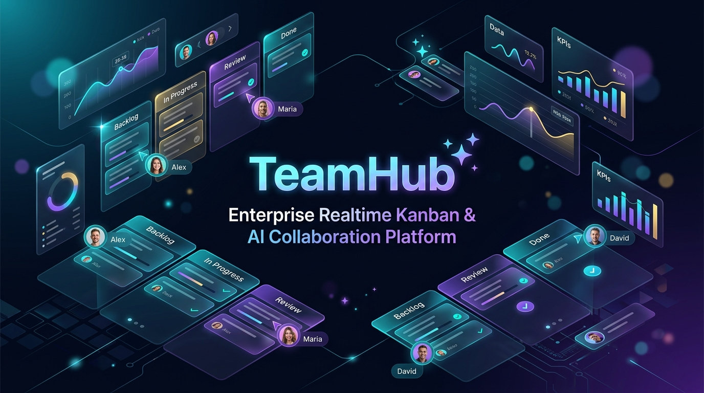
</p>

<p align="center">
  <a href="https://teamhub.tvquang.id.vn"></a>
  <a href="https://supabase.com"></a>
  <a href="https://aiven.io"></a>
</p>

<p align="center">
  
  
  
  
  
  
  
  
  
  
</p>

> **TeamHub** là một nền tảng quản lý dự án & công việc Kanban doanh nghiệp chuẩn Trello được xây dựng với kiến trúc **Decoupled Microservices** hiện đại: Tích hợp **✨ AI Sub-task Breakdown**, **Realtime Socket.IO 2 chiều**, **Box Chat theo từng Board**, **Hàng đợi ngầm BullMQ + Standalone Worker**, **Lưu trữ tệp chuẩn AWS S3 / Supabase Storage**, và **Hệ thống Backup / Restore Board JSON**.

---

## 📞 Hỗ Trợ Kiểm Thử & Liên Hệ (For Recruiters / Reviewers)

> [!NOTE]
> ⚙️ **Lưu ý về Standalone Worker (BullMQ)**: Để tối ưu chi phí Cloud, tiến trình Worker (gửi email nhắc hẹn theo lịch, dọn rác S3, AI Daily Standup) mặc định chạy ở môi trường **Local/Self-hosted** (`cd worker && npm start`). Các luồng email tức thì (xác thực, quên mật khẩu) vẫn hoạt động 100% trên Cloud qua Resend API.
> 
> 💬 **Để bật server Worker Cloud Staging kiểm thử toàn diện, xin vui lòng liên hệ tác giả**:
> - 📞 **Điện thoại / Zalo**: `0357131476` &nbsp;|&nbsp; ✉️ **Email**: `tvquang.working@gmail.com`

---

## 🛠️ Hướng Dẫn Kiểm Thử Dự Án Theo 3 Chế Độ (3 Execution & Deployment Modes)

Dự án TeamHub được thiết kế vô cùng linh hoạt cho Nhà tuyển dụng / Tech Lead có thể kiểm thử hệ thống theo **3 Chế Độ (Modes)** tùy theo nhu cầu và hạ tầng của bạn:

---

### 🌐 Mode 0: Trải Nghiệm Sản Xuất Trực Tiếp Trên Cloud (Instant Live Demo - Zero Setup)
> **Phù hợp nhất cho**: Kiểm thử ứng dụng nhanh ngay lập tức trên trình duyệt mà không cần cài đặt code.

**Ứng Dụng Trực Tiếp (Live Demo)**: **[https://teamhub.tvquang.id.vn](https://teamhub.tvquang.id.vn)**

#### 🔑 4 Tài Khoản Mẫu Nạp Sẵn Dữ Liệu Sản Xuất (Mật khẩu chung: `123456`)
| Role | Email | Mật khẩu | Tính năng chính trải nghiệm |
| :--- | :--- | :--- | :--- |
| **Executive Owner** | `owner@teamhub.local` | `123456` | Executive Analytics Dashboard, Quản lý Members, **Backup & Restore Board JSON**. |
| **Project Manager (Admin)** | `admin@teamhub.local` | `123456` | Quản lý Kanban Lists & Cards, Multi-assignee, Custom Labels, Time Tracking. |
| **Tech Lead (Developer)** | `dev@teamhub.local` | `123456` | **✨ AI Sub-task Breakdown**, Drag & Drop Realtime, Checklists, Up file S3 URL. |
| **UI/UX Lead (Designer)** | `designer@teamhub.local` | `123456` | Dark/Light Mode, Custom Board Backgrounds, Activity Feed & Tagging. |

---

### ☁️ Mode 1: Hybrid Development (Chạy Code Local + Kết Nối Cloud Managed Services)
> **Phù hợp nhất cho**: Kiểm thử và chỉnh sửa Code tại máy cục bộ nhưng dùng dữ liệu Cloud thật (Supabase PostgreSQL + Valkey Redis + Supabase S3).

1. **Clone Repository & Chuyển sang các thư mục**:
   ```bash
   git clone https://github.com/tvquang0511/TeamHub.git
   cd TeamHub
   ```
2. **Kích hoạt nhóm `[MODE 2] CLOUD PRODUCTION` trong tệp `.env`**:
   Mở tệp `backend/.env`, `worker/.env` và `frontend/.env`, giữ nguyên các cấu hình Cloud đang bật (uncommented).
3. **Chạy các Server Development**:
   - **Terminal 1 (Backend)**: `cd backend && npm install && npm run dev`
   - **Terminal 2 (Worker)**: `cd worker && npm install && npm run dev`
   - **Terminal 3 (Frontend)**: `cd frontend && npm install && npm run dev`

---

### 💻 Mode 2: Local Containerized Infrastructure (Chạy Code Local + Hạ Tầng Docker Local)
> **Phù hợp nhất cho**: Phát triển ứng dụng hoàn toàn Offline trên máy cá nhân với hạ tầng PostgreSQL, Redis, MinIO S3 chạy bằng Docker.

1. **Khởi chạy Hạ tầng Docker Containers**:
   ```bash
   docker-compose -f infra/docker-compose.dev.yml up -d
   ```
   *(PostgreSQL `:5432`, Redis `:6379`, MinIO S3 Console `:9001`)*

2. **Chuyển sang nhóm `[MODE 1] LOCAL DEVELOPMENT` trong tệp `.env`**:
   Bật nhóm `[MODE 1]` (uncomment) và tắt nhóm `[MODE 2]` (comment) trong `backend/.env` và `worker/.env`.

3. **Khởi tạo Database Schema & Seed Data**:
   ```bash
   cd backend
   npm install
   npx prisma db push
   npm run seed:demo
   ```

4. **Khởi chạy các Tiến trình**:
   - **Terminal 1 (Backend API)**: `cd backend && npm run dev`
   - **Terminal 2 (Worker)**: `cd worker && npm run dev`
   - **Terminal 3 (Frontend Web)**: `cd frontend && npm run dev`

---

## 🏗️ Sơ Đồ Kiến Trúc Hệ Thống (Enterprise Architecture)

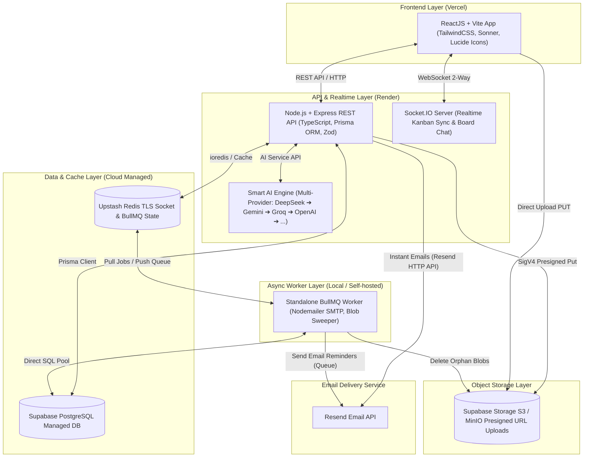
```mermaid
flowchart TD
    subgraph ClientLayer ["Frontend Layer (Vercel)"]
        FE["ReactJS + Vite App (TailwindCSS, Sonner, Lucide Icons)"]
    end

    subgraph APILayer ["API & Realtime Layer (Render)"]
        API["Node.js + Express REST API (TypeScript, Prisma ORM, Zod)"]
        SOCKET["Socket.IO Server (Realtime Kanban Sync & Board Chat)"]
        AI["Smart AI Engine (Multi-Provider: DeepSeek ➔ Gemini ➔ Groq ➔ OpenAI ➔ ...)"]
    end

    subgraph DataLayer ["Data & Cache Layer (Cloud Managed)"]
        DB[("Supabase PostgreSQL Managed DB")]
        REDIS[("Upstash Redis TLS Socket & BullMQ State")]
    end

    subgraph WorkerLayer ["Async Worker Layer (Local / Self-hosted)"]
        WORKER["Standalone BullMQ Worker (Nodemailer SMTP, Blob Sweeper)"]
    end

    subgraph StorageLayer ["Object Storage Layer"]
        S3[("Supabase Storage S3 / MinIO Presigned URL Uploads")]
    end

    subgraph EmailLayer ["Email Delivery Service"]
        RESEND["Resend Email API"]
    end

    FE <-->|"REST API / HTTP"| API
    FE <-->|"WebSocket 2-Way"| SOCKET
    API <-->|"AI Service API"| AI
    API <-->|"Prisma Client"| DB
    API <-->|"ioredis / Cache"| REDIS
    API -->|"SigV4 Presigned Put"| S3
    FE -->|"Direct Upload PUT"| S3
    API -->|"Instant Emails (Resend HTTP API)"| RESEND
    
    REDIS <-->|"Pull Jobs / Push Queue"| WORKER
    WORKER <-->|"Direct SQL Pool"| DB
    WORKER -->|"Delete Orphan Blobs"| S3
    WORKER -->|"Send Email Reminders (Queue)"| RESEND
```

---

## 📸 Giao Diện & Trải Nghiệm Người Dùng (UI Showcase)

| 🌟 Trang Giới Thiệu (Landing Page) | 🔐 Xác Thực & Đăng Nhập (Auth Dark Theme) |
| :---: | :---: |
| 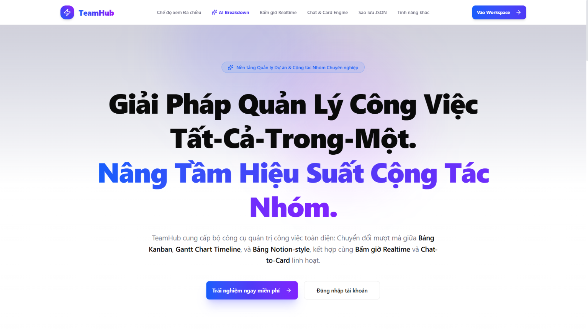 | 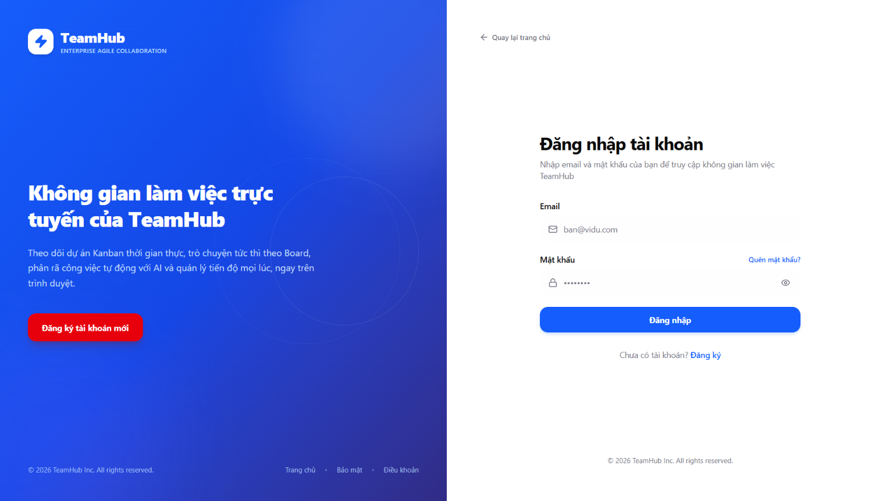 |
| *Giao diện Landing Page giới thiệu ứng dụng hiện đại & sinh động* | *Trang xác thực tài khoản bảo mật với giao diện tối sang trọng* |

| 🏠 Danh Sách Không Gian (Workspaces) | 📂 Chi Tiết Không Gian Làm Việc (Workspace Detail) |
| :---: | :---: |
| 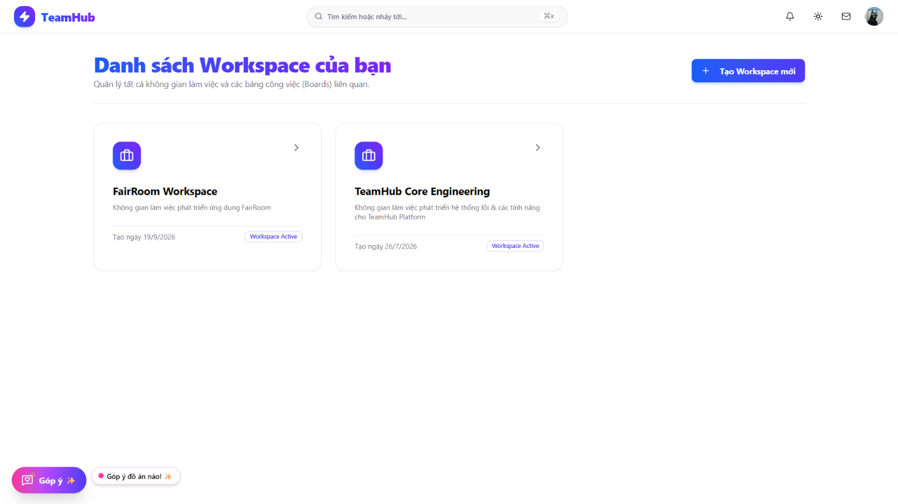 | 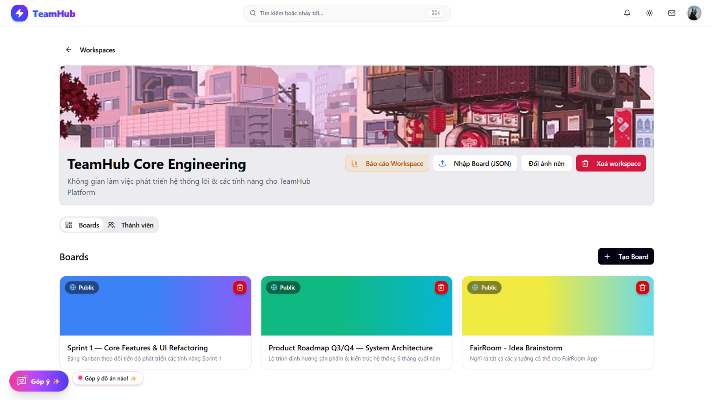 |
| *Quản lý danh sách các Workspace trực quan, tìm kiếm nhanh chóng* | *Không gian Workspace tổng hợp các thẻ Board với màu sắc rực rỡ* |

| ⚡ Bảng Kanban Kéo Thả Trực Quan (Kanban Board) | 📋 Tổng Quan Dự Án & Bộ Lọc (Board View) |
| :---: | :---: |
| 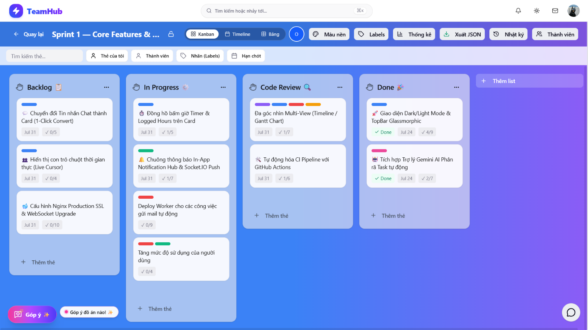 | 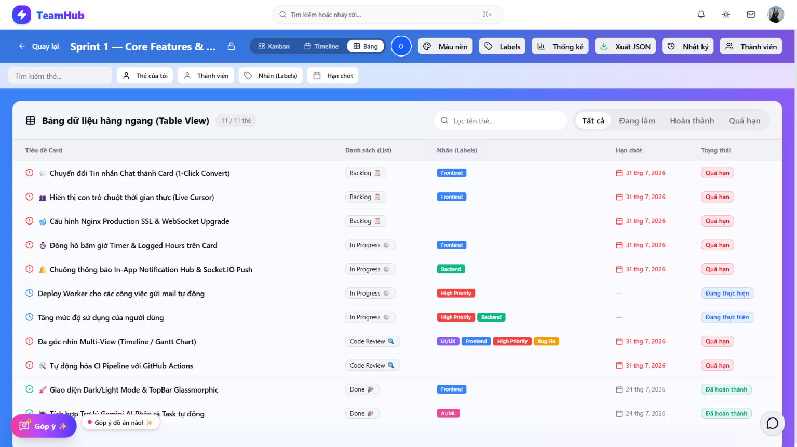 |
| *Tương tác kéo thả thẻ và cột tức thì, đồng bộ 2 chiều Socket.IO* | *Giao diện làm việc Board với bộ lọc linh hoạt & điều hướng tiện lợi* |

| 📅 Lịch Trình Dự Án (Timeline / Gantt View) | 📊 Báo Cáo Hiệu Suất (Analytics Dashboard) |
| :---: | :---: |
| 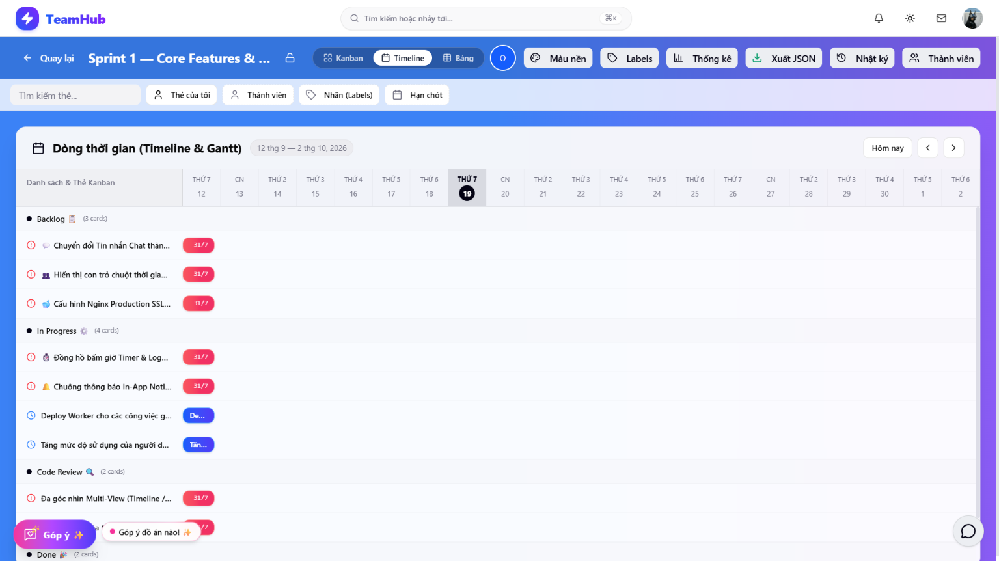 | 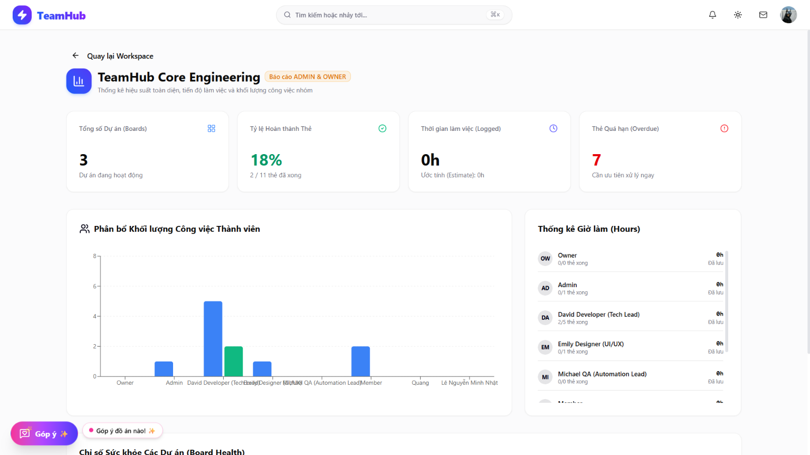 |
| *Trực quan hóa thời hạn (Deadline) và tiến trình công việc dạng Timeline* | *Executive Dashboard: Thống kê KPI, tỷ lệ hoàn thành nhiệm vụ* |

| ⚙️ Chi Tiết Thẻ Công Việc (Card Details) | ✨ AI Phân Rã Tác Vụ Tự Động (AI Breakdown) |
| :---: | :---: |
| 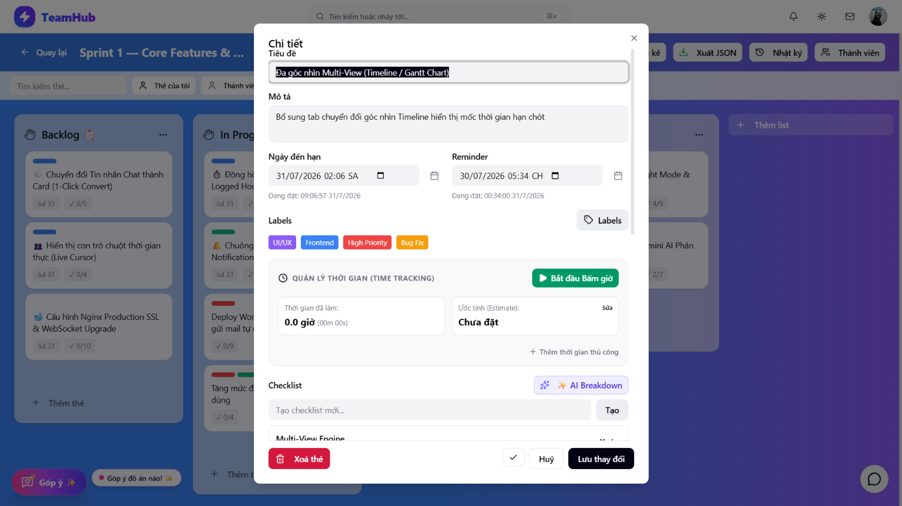 | 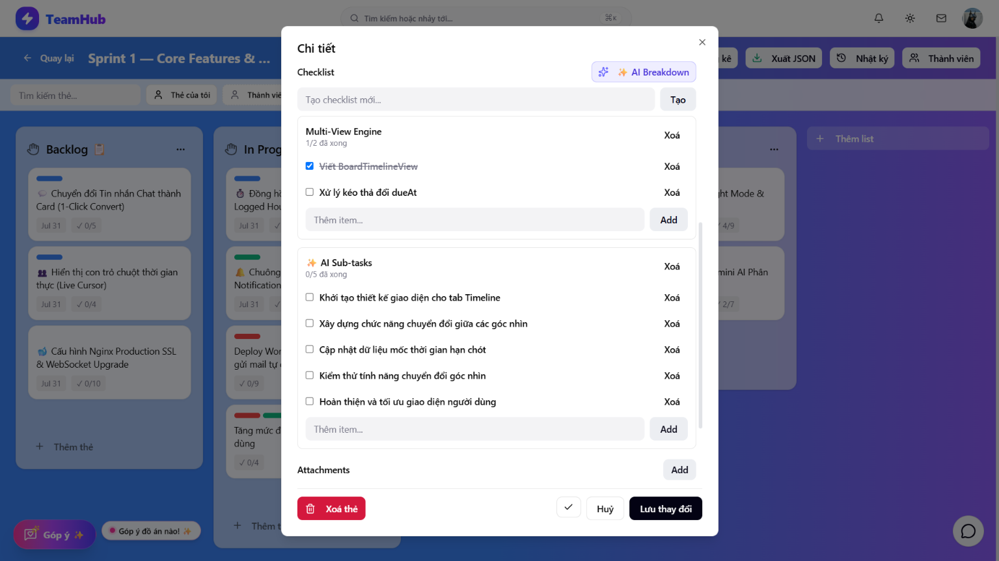 |
| *Quản lý Checklists, Labels nhãn dán, Thời hạn và Đính kèm tệp tin* | *Tự động phân rã 3-5 sub-tasks chi tiết bằng AI chỉ trong 1-Click* |

| 📝 Bình Luận & Thảo Luận Thẻ (Card Comments) | 💬 Hộp Thoại Chat Realtime (Board Chat) |
| :---: | :---: |
| 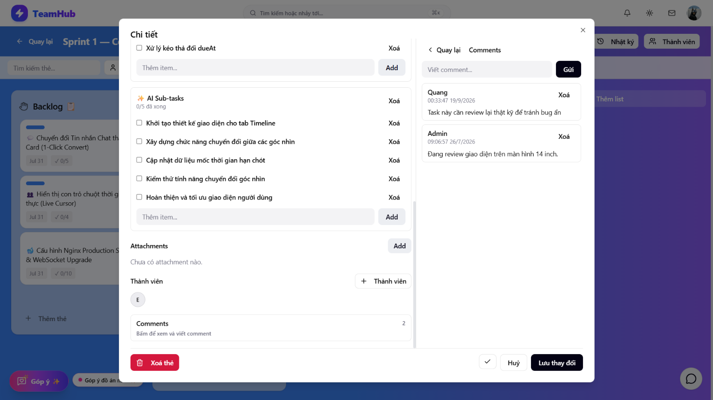 | 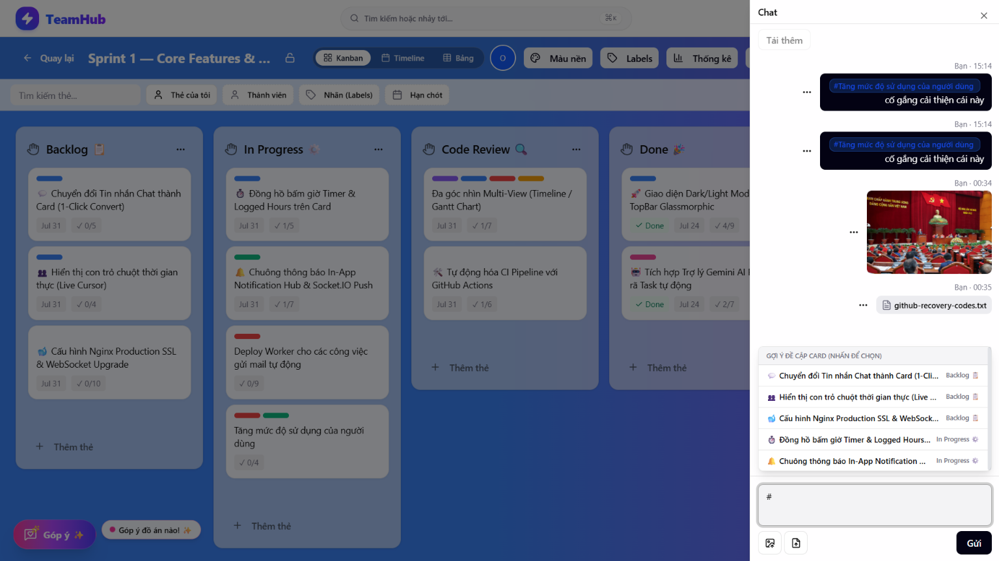 |
| *Trao đổi, phản hồi và tag thành viên làm việc ngay trên từng thẻ* | *Phòng trò chuyện trực tiếp theo từng board, lưu trữ lịch sử tin nhắn* |

| 🏷️ Hệ Thống Nhãn Dán Đa Sắc (Custom Labels) | 🎨 Tùy Biến Hình Nền Board (Board Backgrounds) |
| :---: | :---: |
| 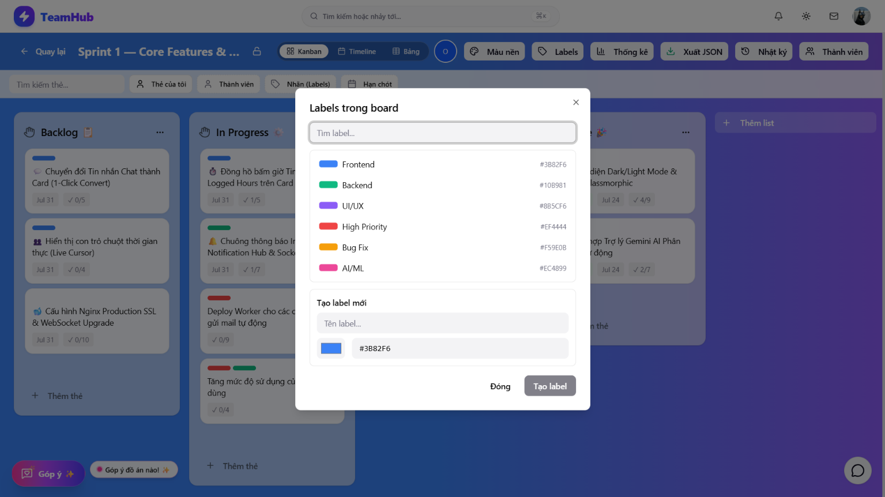 | 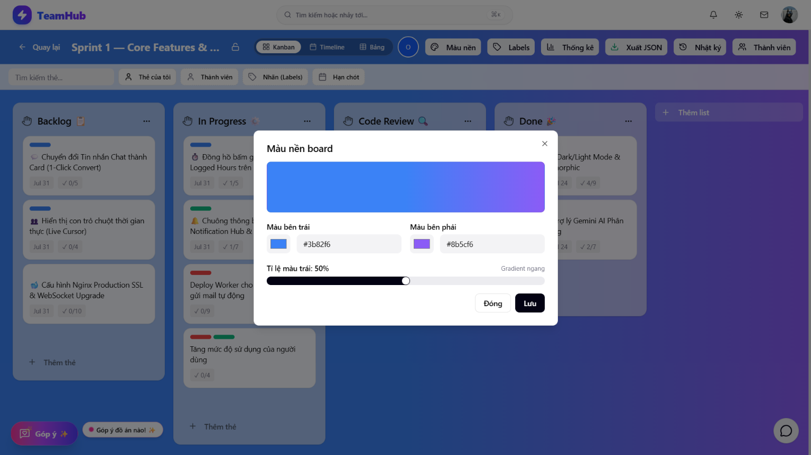 |
| *Tạo và quản lý nhãn dán công việc với bảng màu sắc đa dạng* | *Cá nhân hóa giao diện làm việc với bộ sưu tập hình nền gradient sống động* |

| 📜 Nhật Ký Hoạt Động Hệ Thống (Audit Log) | 👥 Quản Lý Thành Viên & Phân Quyền (Member Management) |
| :---: | :---: |
| 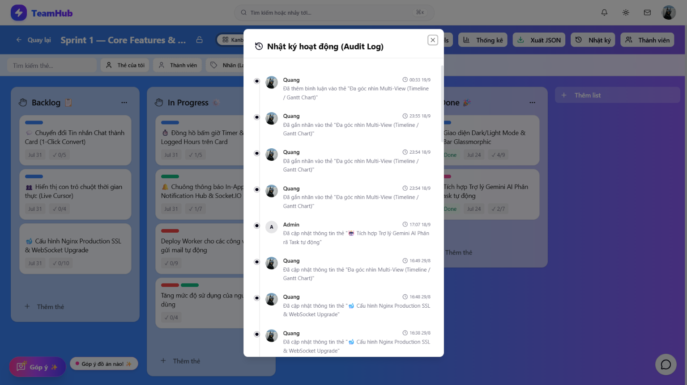 | 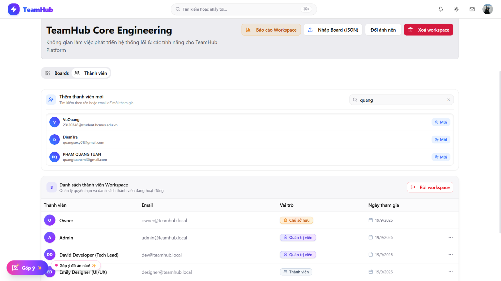 |
| *Lịch sử truy vết mọi thao tác thay đổi, thêm sửa xóa trong Workspace* | *Thanh tìm kiếm thành viên gọn gàng, phân quyền vai trò linh hoạt* |

| 👤 Hồ Sơ & Cài Đặt Cá Nhân (User Profile) | 💡 Đóng Góp Ý Kiến & Phản Hồi (User Feedback) |
| :---: | :---: |
| 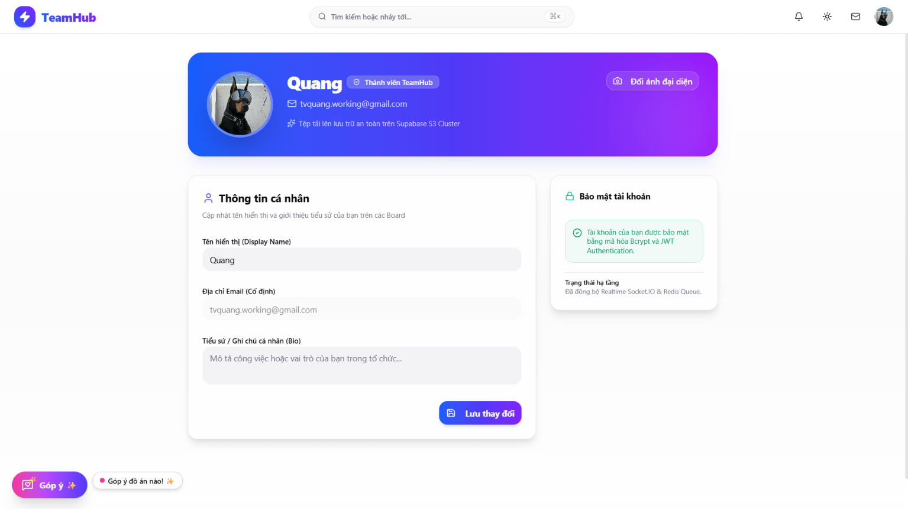 | 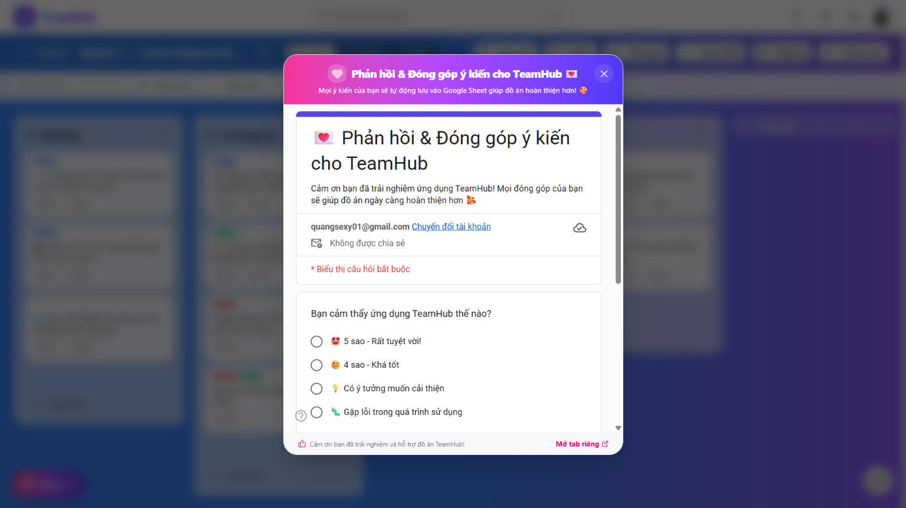 |
| *Quản lý thông tin tài khoản, cập nhật ảnh đại diện và mật khẩu* | *Widget tiếp nhận đóng góp ý kiến & phản hồi đánh giá đồ án* |

---

## 💎 5 Tính Năng Cốt Lõi (Core Features)

### 1️⃣ ✨ Smart AI Sub-task Breakdown Engine
- **Phân rã Công việc Thông minh**: Tự động đọc Tiêu đề và Mô tả của Card để phân rã thành **3-5 sub-tasks chi tiết, thực tế và sẵn sàng hành động** bằng Tiếng Việt chỉ trong 1-Click.
- **Cơ chế Fallback Bất Tử (Fault Tolerance)**: Hệ thống tự động chuyển đổi thông minh qua chuỗi các AI Provider (DeepSeek ➔ Gemini ➔ Groq ➔ Together ➔ OpenAI ➔ OpenRouter). Nếu một AI quá tải hoặc hết tiền, AI khác sẽ ngay lập tức thay thế (Vì lý do ngân sách có hạn)
- **Tạo Checklist Tự động**: Tự động tạo và lưu danh sách checklist vào CSDL PostgreSQL.

### 2️⃣ Realtime Kanban & Board Chat (Socket.IO + Redis)
- **Đồng bộ Kéo Thả 2 Chiều**: Kéo thả thẻ (Card) hoặc cột (List) ở màn hình này sẽ ngay lập tức di chuyển ở màn hình của các thành viên khác trong Board không cần F5.
- **Dedicated Board Chat Box**: Mỗi Board sở hữu một phòng Chat riêng biệt với tin nhắn lưu trữ bất biến và đính kèm tệp tin.

### 3️⃣ Standalone Async Worker Queue (BullMQ)
- **Tách biệt hoàn toàn**: Tiến trình Worker chạy độc lập với API Server, rút các công việc nặng và lập lịch định kỳ từ Redis. Nếu muốn trải nghiệm các tính năng này trên Cloud, xin hãy liên hệ tác giả.
- **Tính năng của Worker**: 
  - Đếm ngược và tự động gửi Email Nhắc Nhở (`Email Reminder`) khi sắp đến hạn chót (Deadline).
  - Tự động quét và xóa tệp tin rác mồ côi (Orphan Blobs) trên S3.
  - Tổng hợp dữ liệu Thống Kê hàng ngày (`Analytics Daily Rollup`) và AI Daily Standup báo cáo dự án.

### 4️⃣ S3 Direct Presigned Upload & Blob Sweeper Clean
- **Bảo mật & Tốc độ**: Client xin Presigned PUT URL từ Backend và tải tệp tin thẳng lên Supabase S3 mà không đi qua server API (tiết kiệm băng thông server).
- **Auto Clean Orphan Blobs**: Worker tự động rà soát và dọn dẹp các tệp tin rác không còn liên kết trong DB.

### 5️⃣ Executive Board JSON Backup & Restoration System
- **An Toàn Dữ Liệu**: Cho phép Export toàn bộ Board (Danh sách cột, thẻ, checklist, bình luận, nhãn) ra tệp JSON chuẩn hóa và Restore lại nguyên trạng ở bất kỳ Workspace nào.

---

## 📄 License & Contact
Bản quyền đồ án phát triển bởi **Trần Vũ Quang**.
- 📞 **Điện thoại**: `0357131476`
- ✉️ **Email**: `tvquang.working@gmail.com`
