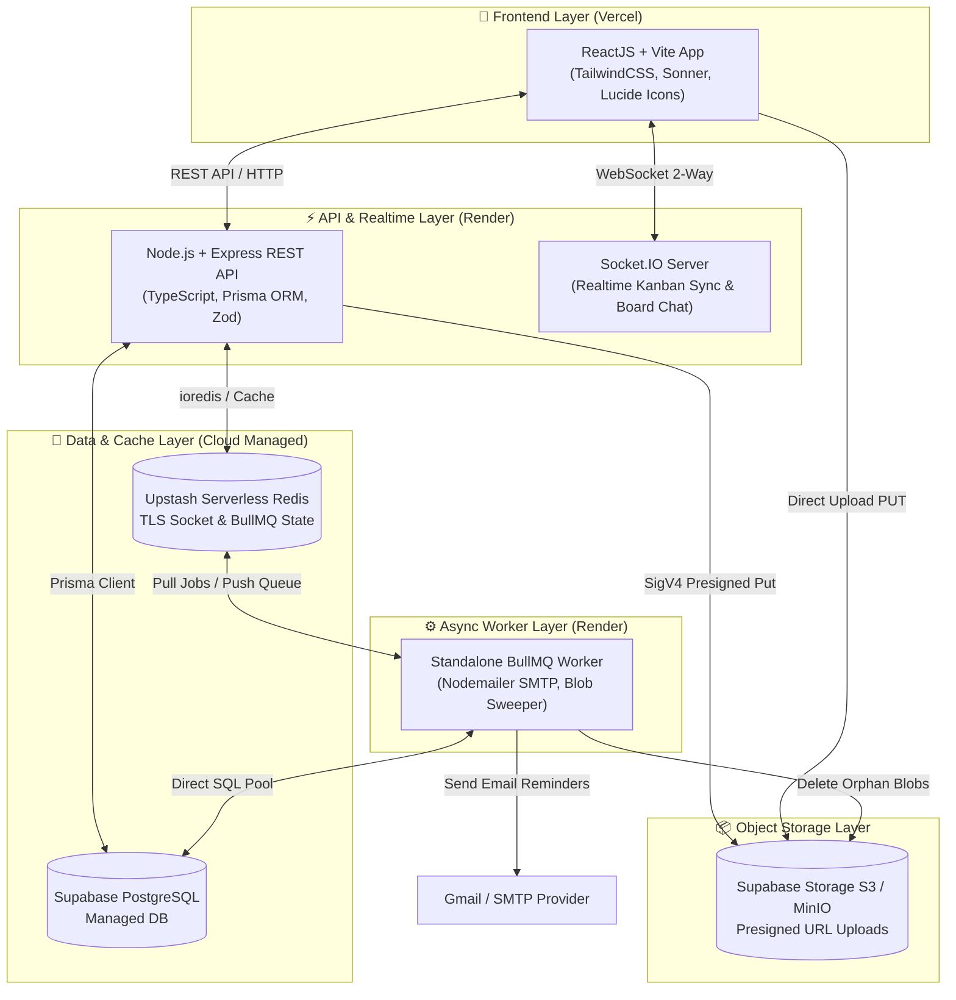

# 🚀 TeamHub — Enterprise Trello-Like Realtime Kanban + Board Chat + Async BullMQ Email Worker

[](https://team-hub-blond.vercel.app)
[](https://teamhub-backend-api.onrender.com)
[](https://teamhub-worker.onrender.com)
[](https://supabase.com)
[](https://upstash.com)

> **TeamHub** là một nền tảng quản lý công việc Kanban doanh nghiệp chuẩn Trello được xây dựng với kiến trúc **Decoupled Microservices** hiện đại: Tích hợp **Realtime Socket.IO 2 chiều**, **Box Chat theo từng Board**, **Hàng đợi ngầm BullMQ + Standalone Worker**, **Lưu trữ tệp chuẩn AWS S3 / Supabase Storage**, và **Hệ thống Backup / Restore Board JSON**.

---

## 🌐 1. Live Cloud Production Deployments

| Thành phần (Component) | Nền tảng (Platform) | Đường dẫn Live (Production URL) |
| :--- | :--- | :--- |
| **Frontend Web App** | **Vercel** | 🔗 **[https://team-hub-blond.vercel.app](https://team-hub-blond.vercel.app)** |
| **Backend REST API** | **Render.com** | ⚡ **[https://teamhub-backend-api.onrender.com](https://teamhub-backend-api.onrender.com)** |
| **Standalone Worker** | **Render.com** | ⚙️ **[https://teamhub-worker.onrender.com](https://teamhub-worker.onrender.com)** |
| **Managed PostgreSQL** | **Supabase** | 🐘 `db.hqtnfzpibofamwgxhfip.supabase.co:5432` |
| **Serverless Redis** | **Upstash Redis** | 🔴 `upward-oyster-168354.upstash.io:6379` (TLS) |
| **Object Storage S3** | **Supabase S3** | 📦 `hqtnfzpibofamwgxhfip.storage.supabase.co` |

---

## 🔑 2. Hướng Dẫn Test Cho Nhà Tuyển Dụng (4 Demo Modes)

Dành cho Nhà tuyển dụng / Tech Lead muốn trải nghiệm trực tiếp hệ thống. Bạn có thể sử dụng **4 Tài khoản mẫu theo 4 Vai trò (Role Modes)** đã được nạp sẵn dữ liệu trên Supabase Production:

> 🔑 **Mật khẩu dùng chung cho tất cả các tài khoản mẫu**: **`123456`**

> [!TIP]
> Bạn có thể mở 2 trình duyệt khác nhau (hoặc 1 Tab thường + 1 Tab Khẩn danh) đăng nhập 2 tài khoản khác nhau để test tính năng **Kéo thả Kanban Realtime** và **Chat Box Realtime** đồng bộ lập tức!

| Role Mode | Email Đăng Nhập | Mật Khẩu | Điểm Nổi Bật Cần Trải Nghiệm (Test Features) |
| :--- | :--- | :--- | :--- |
| 👑 **Mode 1: Executive Owner** | `owner@teamhub.local` | `123456` | **Quyền Cao Nhất**: Xem Executive Analytics Dashboard 30 ngày, Quản lý Workspace Members, Mời người dùng mới, **Export / Import Backup Board JSON**. |
| 🛡️ **Mode 2: Project Manager (Admin)** | `admin@teamhub.local` | `123456` | **Quản lý Dự án**: Tạo/Xóa Kanban Lists & Cards, Phân công công việc (Multi-assignee), Đặt nhãn Custom Labels, Báo cáo thời gian (Time Tracking). |
| 💻 **Mode 3: Tech Lead (Developer)** | `dev@teamhub.local` | `123456` | **Thao tác Thẻ & Tệp tin**: Thêm/Xóa Checklists, Up tệp đính kèm trực tiếp lên Supabase S3 bằng Presigned PUT URL, Chat Box Realtime theo Board. |
| 🎨 **Mode 4: UI/UX Lead (Designer)** | `designer@teamhub.local` | `123456` | **Trải nghiệm Giao diện**: Chuyển đổi Dark/Light Mode, Đổi hình nền Board tùy chỉnh, Bình luận Activity Feed & Tag tên thành viên. |

---

## 🏗️ 3. Sơ Đồ Kiến Trúc Hệ Thống (Enterprise Architecture)


```mermaid
flowchart TD
    subgraph ClientLayer ["🎨 Frontend Layer (Vercel)"]
        FE["ReactJS + Vite App\n(TailwindCSS, Sonner, Lucide Icons)"]
    end

    subgraph APILayer ["⚡ API & Realtime Layer (Render)"]
        API["Node.js + Express REST API\n(TypeScript, Prisma ORM, Zod)"]
        SOCKET["Socket.IO Server\n(Realtime Kanban Sync & Board Chat)"]
    end

    subgraph DataLayer ["🐘 Data & Cache Layer (Cloud Managed)"]
        DB[(Supabase PostgreSQL\nManaged DB)]
        REDIS[(Upstash Serverless Redis\nTLS Socket & BullMQ State)]
    end

    subgraph WorkerLayer ["⚙️ Async Worker Layer (Render)"]
        WORKER["Standalone BullMQ Worker\n(Nodemailer SMTP, Blob Sweeper)"]
    end

    subgraph StorageLayer ["📦 Object Storage Layer"]
        S3[(Supabase Storage S3 / MinIO\nPresigned URL Uploads)]
    end

    FE <-->|REST API / HTTP| API
    FE <-->|WebSocket 2-Way| SOCKET
    API <-->|Prisma Client| DB
    API <-->|ioredis / Cache| REDIS
    API -->|SigV4 Presigned Put| S3
    FE -->|Direct Upload PUT| S3
    
    REDIS <-->|Pull Jobs / Push Queue| WORKER
    WORKER <-->|Direct SQL Pool| DB
    WORKER -->|Delete Orphan Blobs| S3
    WORKER -->|Send Email Reminders| SMTP[Gmail / SMTP Provider]
```

---

## 💎 4. 4 Trụ Cột Tính Năng Cốt Lõi (Core Features)

### 1️⃣ Realtime Kanban & Board Chat (Socket.IO + Redis)
- **Đồng bộ Kéo Thả 2 Chiều**: Kéo thả thẻ (Card) hoặc cột (List) ở Tab này sẽ ngay lập tức di chuyển ở màn hình của các thành viên khác trong Board không cần F5.
- **Dedicated Board Chat Box**: Mỗi Board sở hữu một phòng Chat riêng biệt với tin nhắn lưu trữ bất biến và đính kèm tệp tin.

### 2️⃣ Standalone Async Worker Queue (BullMQ + SMTP)
- **Tách biệt hoàn toàn**: Tiến trình Worker chạy độc lập với API Server, rút các công việc nặng từ Upstash Redis để gửi Email Nhắc Nhở (`Email Reminder`) và tổng hợp dữ liệu Thống Kê hàng ngày (`Analytics Daily Rollup`).

### 3️⃣ S3 Direct Presigned Upload & Blob Sweeper Clean
- **Bảo mật & Tốc độ**: Client xin Presigned PUT URL từ Backend và tải tệp tin thẳng lên Supabase S3 mà không đi qua server API (tiết kiệm băng thông server).
- **Auto Clean Orphan Blobs**: Worker tự động rà soát và dọn dẹp các tệp tin rác không còn liên kết trong DB.

### 4️⃣ Executive Board JSON Backup & Restoration System
- **An Toàn Dữ Liệu**: Cho phép Export toàn bộ Board (Danh sách cột, thẻ, checklist, bình luận, nhãn) ra tệp JSON chuẩn hóa và Restore lại nguyên trạng ở bất kỳ Workspace nào.

---

## 🛠️ 5. Hướng Dẫn Chạy Local (Local Development)

Dự án hỗ trợ 2 chế độ chạy cực kỳ linh hoạt nhờ cấu trúc `.env` 2 Mode:

### Bước 1: Clone Repository
```bash
git clone https://github.com/tvquang0511/TeamHub.git
cd TeamHub
```

### Bước 2: Khởi động Hạ tầng Local bằng Docker Compose
```bash
docker-compose -f infra/docker-compose.dev.yml up -d
```
*(Khởi chạy PostgreSQL tại `:5432`, Redis tại `:6379`, và MinIO S3 tại `:9000`)*

### Bước 3: Chạy Backend API
```bash
cd backend
npm install
npx prisma db push
npm run seed:demo
npm run dev
```
*(Backend Server chạy tại `http://localhost:4000`)*

### Bước 4: Chạy Standalone Worker
```bash
cd ../worker
npm install
npm run dev
```

### Bước 5: Chạy Frontend Web App
```bash
cd ../frontend
npm install
npm run dev
```
*(Frontend chạy tại `http://localhost:5173`)*

---

## 📄 License
Đồ án thuộc bản quyền phát triển bởi **TeamHub Engineering Team**. Tất cả mã nguồn sẵn sàng cho việc đánh giá tuyển dụng và kiểm thử sản phẩm.