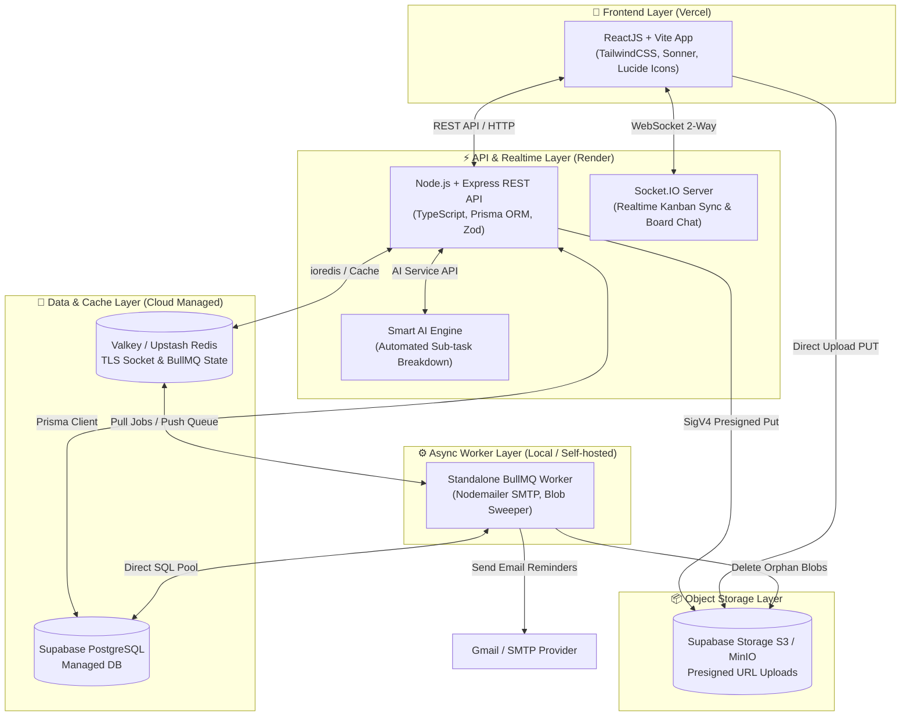

# 🚀 TeamHub — Enterprise Realtime Kanban + Board Chat + AI Sub-task Breakdown + Async BullMQ Worker

[](https://teamhub-frontend.vercel.app)
[](https://teamhub-backend-api.onrender.com)
[](https://github.com/tvquang0511/TeamHub)
[](https://supabase.com)
[](https://aiven.io)

> **TeamHub** là một nền tảng quản lý dự án & công việc Kanban doanh nghiệp chuẩn Trello được xây dựng với kiến trúc **Decoupled Microservices** hiện đại: Tích hợp **✨ AI Sub-task Breakdown**, **Realtime Socket.IO 2 chiều**, **Box Chat theo từng Board**, **Hàng đợi ngầm BullMQ + Standalone Worker**, **Lưu trữ tệp chuẩn AWS S3 / Supabase Storage**, và **Hệ thống Backup / Restore Board JSON**.

---

## 📞 Hỗ Trợ Kiểm Thử & Thông Tin Liên Hệ (For Recruiters / Reviewers)

> [!IMPORTANT]
> ⚠️ **LƯU Ý VỀ TIẾN TRÌNH WORKER (BullMQ Email & AI Daily Standup)**:
> Vì lý do giới hạn ngân sách & tài chính, tiến trình Standalone Worker (BullMQ Worker) được cài đặt mặc định chạy ở môi trường **Local/Self-hosted** (`cd worker && npm start`).
> 
> **Nếu Nhà tuyển dụng / Reviewer muốn kiểm thử trực tiếp full luồng tính năng gửi Email tự động và AI Daily Standup Worker trên môi trường Cloud Staging**, xin vui lòng liên hệ trực tiếp với tác giả để mình bật worker instance ngay lập tức:
> - 📞 **Số điện thoại / Zalo**: `0357131476`
> - ✉️ **Email**: `tvquang.working@gmail.com`

---

## 🛠️ Hướng Dẫn Kiểm Thử Dự Án Theo 4 Chế Độ (4 Execution & Deployment Modes)

Dự án TeamHub được thiết kế vô cùng linh hoạt cho Nhà tuyển dụng / Tech Lead có thể kiểm thử hệ thống theo **4 Chế Độ (Modes)** tùy theo nhu cầu và hạ tầng của bạn:

---

### 🌐 Mode 0: Trải Nghiệm Sản Xuất Trực Tiếp Trên Cloud (Instant Live Demo - Zero Setup)
> **Phù hợp nhất cho**: Kiểm thử ứng dụng nhanh ngay lập tức trên trình duyệt mà không cần cài đặt code.

- **Frontend App (Vercel)**: 🔗 **[https://teamhub-frontend.vercel.app](https://teamhub-frontend.vercel.app)**
- **Backend API (Render)**: ⚡ **[https://teamhub-backend-api.onrender.com](https://teamhub-backend-api.onrender.com)**

#### 🔑 4 Tài Khoản Mẫu Nạp Sẵn Dữ Liệu Sản Xuất (Mật khẩu chung: `123456`)
| Role | Email | Mật khẩu | Tính năng chính trải nghiệm |
| :--- | :--- | :--- | :--- |
| 👑 **Executive Owner** | `owner@teamhub.local` | `123456` | Executive Analytics Dashboard, Quản lý Members, **Backup & Restore Board JSON**. |
| 🛡️ **Project Manager (Admin)** | `admin@teamhub.local` | `123456` | Quản lý Kanban Lists & Cards, Multi-assignee, Custom Labels, Time Tracking. |
| 💻 **Tech Lead (Developer)** | `dev@teamhub.local` | `123456` | **✨ AI Sub-task Breakdown**, Drag & Drop Realtime, Checklists, Up file S3 URL. |
| 🎨 **UI/UX Lead (Designer)** | `designer@teamhub.local` | `123456` | Dark/Light Mode, Custom Board Backgrounds, Activity Feed & Tagging. |

---

### ☁️ Mode 1: Hybrid Development (Chạy Code Local + Kết Nối Cloud Managed Services)
> **Phù hợp nhất cho**: Kiểm thử và chỉnh sửa Code tại máy cục bộ nhưng dùng dữ liệu Cloud thật (Supabase PostgreSQL + Valkey Redis + Supabase S3).

1. **Clone Repository & Chuyển sang các thư mục**:
   ```bash
   git clone https://github.com/tvquang0511/TeamHub.git
   cd TeamHub
   ```
2. **Kích hoạt nhóm `[MODE 2] CLOUD PRODUCTION` trong tệp `.env`**:
   Mở tệp `backend/.env`, `worker/.env` và `frontend/.env`, giữ nguyên các cấu hình Cloud đang bật (uncommented).
3. **Chạy các Server Development**:
   - **Terminal 1 (Backend)**: `cd backend && npm install && npm run dev`
   - **Terminal 2 (Worker)**: `cd worker && npm install && npm run dev`
   - **Terminal 3 (Frontend)**: `cd frontend && npm install && npm run dev`

---

### 💻 Mode 2: Local Containerized Infrastructure (Chạy Code Local + Hạ Tầng Docker Local)
> **Phù hợp nhất cho**: Phát triển ứng dụng hoàn toàn Offline trên máy cá nhân với hạ tầng PostgreSQL, Redis, MinIO S3 chạy bằng Docker.

1. **Khởi chạy Hạ tầng Docker Containers**:
   ```bash
   docker-compose -f infra/docker-compose.dev.yml up -d
   ```
   *(PostgreSQL `:5432`, Redis `:6379`, MinIO S3 Console `:9001`)*

2. **Chuyển sang nhóm `[MODE 1] LOCAL DEVELOPMENT` trong tệp `.env`**:
   Bật nhóm `[MODE 1]` (uncomment) và tắt nhóm `[MODE 2]` (comment) trong `backend/.env` và `worker/.env`.

3. **Khởi tạo Database Schema & Seed Data**:
   ```bash
   cd backend
   npm install
   npx prisma db push
   npm run seed:demo
   ```

4. **Khởi chạy các Tiến trình**:
   - **Terminal 1 (Backend API)**: `cd backend && npm run dev`
   - **Terminal 2 (Worker)**: `cd worker && npm run dev`
   - **Terminal 3 (Frontend Web)**: `cd frontend && npm run dev`

---

### 🐳 Mode 3: Full Stack Production Docker Compose (1-Command Full Deployment)
> **Phù hợp nhất cho**: Đánh giá khả năng Đóng gói Docker Container & Nginx Reverse Proxy toàn bộ hệ thống bằng đúng 1 câu lệnh.

1. **Khởi chạy Toàn Bộ Hệ Thống (Nginx + Frontend + Backend + Worker + Postgres + Redis + MinIO)**:
   ```bash
   docker-compose -f infra/docker-compose.yml up -d
   ```

2. **Truy cập Ứng dụng**:
   - **Frontend App qua Nginx Proxy**: 🔗 `http://localhost` (Port 80)
   - **MinIO S3 Console**: 📦 `http://localhost:9001` (User: `teamhub`, Password: `teamhub-secret`)

---

## 🏗️ Sơ Đồ Kiến Trúc Hệ Thống (Enterprise Architecture)


```mermaid
flowchart TD
    subgraph ClientLayer ["🎨 Frontend Layer (Vercel)"]
        FE["ReactJS + Vite App\n(TailwindCSS, Sonner, Lucide Icons)"]
    end

    subgraph APILayer ["⚡ API & Realtime Layer (Render)"]
        API["Node.js + Express REST API\n(TypeScript, Prisma ORM, Zod)"]
        SOCKET["Socket.IO Server\n(Realtime Kanban Sync & Board Chat)"]
        AI["Smart AI Engine\n(Automated Sub-task Breakdown)"]
    end

    subgraph DataLayer ["🐘 Data & Cache Layer (Cloud Managed)"]
        DB[(Supabase PostgreSQL\nManaged DB)]
        REDIS[(Valkey / Upstash Redis\nTLS Socket & BullMQ State)]
    end

    subgraph WorkerLayer ["⚙️ Async Worker Layer (Local / Self-hosted)"]
        WORKER["Standalone BullMQ Worker\n(Nodemailer SMTP, Blob Sweeper)"]
    end

    subgraph StorageLayer ["📦 Object Storage Layer"]
        S3[(Supabase Storage S3 / MinIO\nPresigned URL Uploads)]
    end

    FE <-->|REST API / HTTP| API
    FE <-->|WebSocket 2-Way| SOCKET
    API <-->|AI Service API| AI
    API <-->|Prisma Client| DB
    API <-->|ioredis / Cache| REDIS
    API -->|SigV4 Presigned Put| S3
    FE -->|Direct Upload PUT| S3
    
    REDIS <-->|Pull Jobs / Push Queue| WORKER
    WORKER <-->|Direct SQL Pool| DB
    WORKER -->|Delete Orphan Blobs| S3
    WORKER -->|Send Email Reminders| SMTP[Gmail / SMTP Provider]
```

---

## 💎 5 Tính Năng Cốt Lõi (Core Features)

### 1️⃣ ✨ Smart AI Sub-task Breakdown Engine
- **Phân rã Công việc Thông minh**: Tự động đọc Tiêu đề và Mô tả của Card để phân rã thành **3-5 sub-tasks chi tiết, thực tế và sẵn sàng hành động** bằng Tiếng Việt chỉ trong 1-Click.
- **Tạo Checklist Tự động**: Tự động tạo và lưu danh sách checklist vào CSDL PostgreSQL.

### 2️⃣ Realtime Kanban & Board Chat (Socket.IO + Redis)
- **Đồng bộ Kéo Thả 2 Chiều**: Kéo thả thẻ (Card) hoặc cột (List) ở màn hình này sẽ ngay lập tức di chuyển ở màn hình của các thành viên khác trong Board không cần F5.
- **Dedicated Board Chat Box**: Mỗi Board sở hữu một phòng Chat riêng biệt với tin nhắn lưu trữ bất biến và đính kèm tệp tin.

### 3️⃣ Standalone Async Worker Queue (BullMQ + SMTP)
- **Tách biệt hoàn toàn**: Tiến trình Worker chạy độc lập với API Server, rút các công việc nặng từ Redis để gửi Email Nhắc Nhở (`Email Reminder`) và tổng hợp dữ liệu Thống Kê hàng ngày (`Analytics Daily Rollup`).

### 4️⃣ S3 Direct Presigned Upload & Blob Sweeper Clean
- **Bảo mật & Tốc độ**: Client xin Presigned PUT URL từ Backend và tải tệp tin thẳng lên Supabase S3 mà không đi qua server API (tiết kiệm băng thông server).
- **Auto Clean Orphan Blobs**: Worker tự động rà soát và dọn dẹp các tệp tin rác không còn liên kết trong DB.

### 5️⃣ Executive Board JSON Backup & Restoration System
- **An Toàn Dữ Liệu**: Cho phép Export toàn bộ Board (Danh sách cột, thẻ, checklist, bình luận, nhãn) ra tệp JSON chuẩn hóa và Restore lại nguyên trạng ở bất kỳ Workspace nào.

---

## 📄 License & Contact
Bản quyền đồ án phát triển bởi **Trần Vũ Quang**.
- 📞 **Điện thoại**: `0357131476`
- ✉️ **Email**: `tvquang.working@gmail.com`