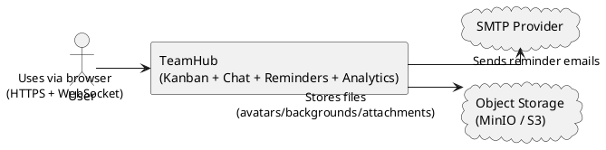
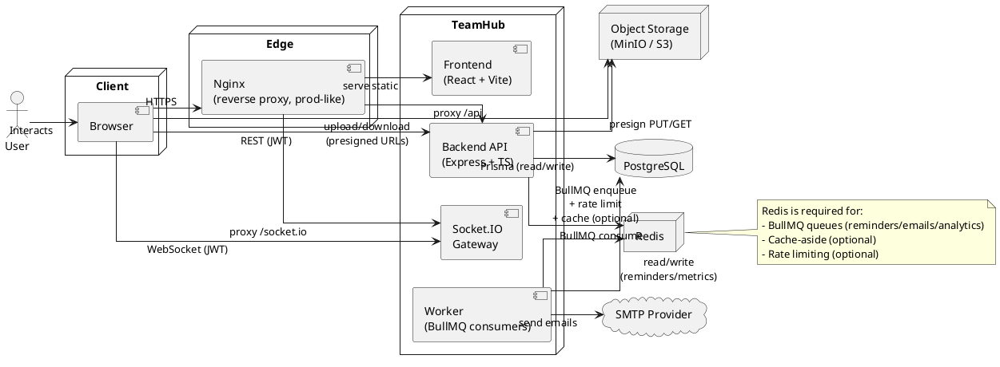

# TeamHub — C4 Model (Level 1–2)

> Mục tiêu: mô tả hệ thống theo chuẩn C4 đến Level 2 (System Context + Container).
> Diagrams dùng PlantUML (không phụ thuộc thư viện C4-PlantUML).

---

## Level 1 — System Context

---

## Level 2 — Containers

