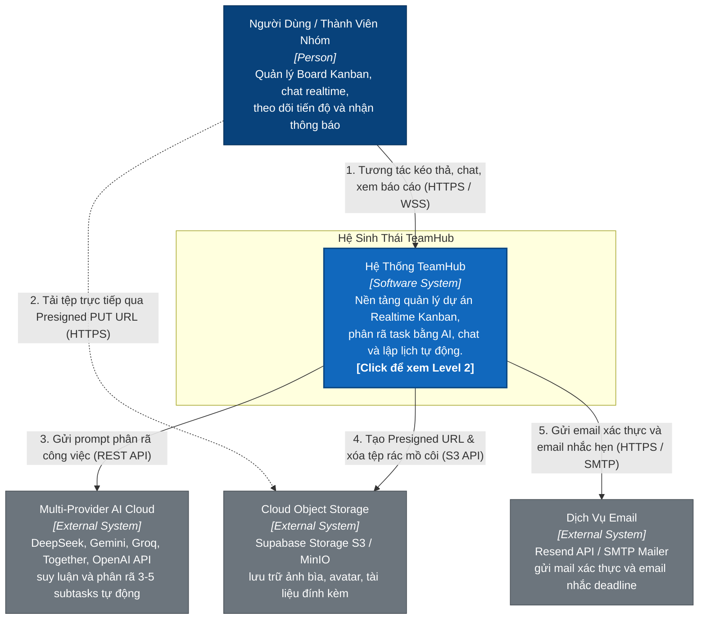
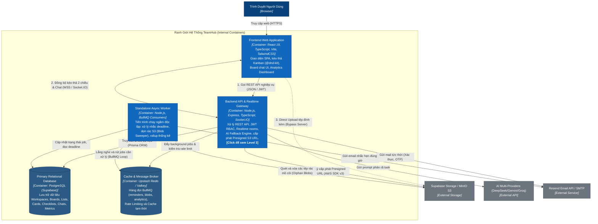
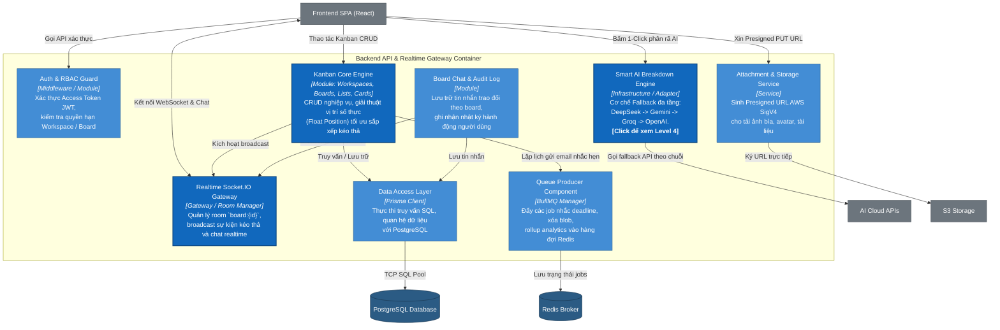
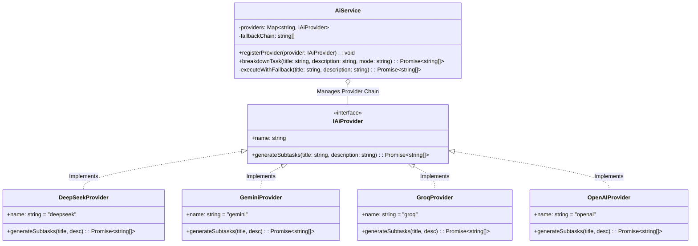

# Kiến Trúc C4 Model — TeamHub Platform

> **Hướng dẫn tương tác**: Sơ đồ bên dưới được thiết kế theo chuẩn **C4 Model** (Context -> Container -> Component).  
> **Lưu ý**: Bạn có thể click trực tiếp vào các khối (ví dụ: khối `TeamHub`, `Backend API`) trong sơ đồ để tự động chuyển tiếp (drill-down) xuống cấp độ chi tiết hơn.

---

## Điều hướng nhanh (Navigation)
- [Level 1: System Context Diagram (Bối cảnh hệ thống)](#level-1--system-context-diagram)
- [Level 2: Container Diagram (Mô hình Container)](#level-2--container-diagram)
- [Level 3: Component Diagram (Thành phần chi tiết Backend API)](#level-3--component-diagram)
- [Level 4: Code / Design Pattern Diagram (Smart AI Fallback Engine)](#level-4--code--design-pattern-diagram)

---

## Level 1 — System Context Diagram
> **Mục tiêu**: Định vị hệ thống TeamHub trong mối tương quan với Người dùng và các Hệ thống dịch vụ đám mây bên ngoài (External Services).

```mermaid
flowchart TD
    classDef userStyle fill:#08427b,stroke:#052e56,color:#fff;
    classDef systemStyle fill:#1168bd,stroke:#0b4884,color:#fff,stroke-width:2px;
    classDef extStyle fill:#6c757d,stroke:#495057,color:#fff;

    User["Người Dùng / Thành Viên Nhóm<br/><i>[Person]</i><br/>Quản lý Board Kanban, chat realtime,<br/>theo dõi tiến độ và nhận thông báo"]:::userStyle

    subgraph Boundary ["Hệ Sinh Thái TeamHub"]
        TeamHub["Hệ Thống TeamHub<br/><i>[Software System]</i><br/>Nền tảng quản lý dự án Realtime Kanban,<br/>phân rã task bằng AI, chat và lập lịch tự động.<br/><b>[Click để xem Level 2]</b>"]:::systemStyle
    end

    AI["Multi-Provider AI Cloud<br/><i>[External System]</i><br/>DeepSeek, Gemini, Groq, Together, OpenAI API<br/>suy luận và phân rã 3-5 subtasks tự động"]:::extStyle

    S3["Cloud Object Storage<br/><i>[External System]</i><br/>Supabase Storage S3 / MinIO<br/>lưu trữ ảnh bìa, avatar, tài liệu đính kèm"]:::extStyle

    Mail["Dịch Vụ Email<br/><i>[External System]</i><br/>Resend API / SMTP Mailer<br/>gửi mail xác thực và email nhắc deadline"]:::extStyle

    User -->|"1. Tương tác kéo thả, chat, xem báo cáo (HTTPS / WSS)"| TeamHub
    User -.->|"2. Tải tệp trực tiếp qua Presigned PUT URL (HTTPS)"| S3

    TeamHub -->|"3. Gửi prompt phân rã công việc (REST API)"| AI
    TeamHub -->|"4. Tạo Presigned URL & xóa tệp rác mồ côi (S3 API)"| S3
    TeamHub -->|"5. Gửi email xác thực và email nhắc hẹn (HTTPS / SMTP)"| Mail

    click TeamHub href "#level-2--container-diagram" "Bấm vào đây để xem chi tiết các Container (Level 2)"
```

---

## Level 2 — Container Diagram
> **Mục tiêu**: Thể hiện các đơn vị thực thi độc lập (Containers): Frontend SPA, Backend API Gateway, Standalone Worker, CSDL PostgreSQL, Redis Broker và Object Storage.

```mermaid
flowchart TD
    classDef client fill:#08427b,stroke:#052e56,color:#fff;
    classDef app fill:#1168bd,stroke:#0b4884,color:#fff;
    classDef db fill:#2b5b84,stroke:#19354d,color:#fff;
    classDef ext fill:#6c757d,stroke:#495057,color:#fff;

    User["Trình Duyệt Người Dùng<br/><i>[Browser]</i>"]:::client

    subgraph TeamHubBoundary ["Ranh Giới Hệ Thống TeamHub (Internal Containers)"]
        FE["Frontend Web Application<br/><i>[Container: React 19, TypeScript, Vite, TailwindCSS]</i><br/>Giao diện SPA, kéo thả Kanban (@dnd-kit),<br/>Board chat UI, Analytics Dashboard"]:::app

        API["Backend API & Realtime Gateway<br/><i>[Container: Node.js, Express, TypeScript, Socket.IO]</i><br/>Xử lý REST API, JWT RBAC, Realtime rooms,<br/>AI Fallback Engine, cấp phát Presigned S3 URL.<br/><b>[Click để xem Level 3]</b>"]:::app

        Worker["Standalone Async Worker<br/><i>[Container: Node.js, BullMQ Consumers]</i><br/>Tiến trình chạy ngầm độc lập: xử lý nhắc deadline,<br/>dọn rác S3 (Blob Sweeper), rollup thống kê"]:::app

        DB[("Primary Relational Database<br/><i>[Container: PostgreSQL (Supabase)]</i><br/>Lưu trữ dữ liệu Workspaces, Boards, Lists,<br/>Cards, Checklists, Chats, Metrics")]:::db

        Redis[("Cache & Message Broker<br/><i>[Container: Upstash Redis / Valkey]</i><br/>Hàng đợi BullMQ (reminders, blobs, analytics),<br/>Rate Limiting và Cache tạm thời")]:::db
    end

    S3["Supabase Storage / MinIO S3<br/><i>[External Storage]</i>"]:::ext
    AI["AI Multi-Providers (DeepSeek/Gemini/Groq)<br/><i>[External API]</i>"]:::ext
    Mail["Resend Email API / SMTP<br/><i>[External Service]</i>"]:::ext

    User -->|"Truy cập web (HTTPS)"| FE
    FE -->|"1. Gọi REST API nghiệp vụ (JSON / JWT)"| API
    FE <-->|"2. Đồng bộ kéo thả 2 chiều & Chat (WSS / Socket.IO)"| API
    FE -.->|"3. Direct Upload tệp đính kèm (Bypass Server)"| S3

    API -->|"Truy vấn & lưu dữ liệu (Prisma ORM)"| DB
    API -->|"Đẩy background jobs & kiểm tra rate limit"| Redis
    API -->|"Ký cấp phát Presigned URL (AWS SDK v3)"| S3
    API -->|"Gửi prompt phân rã task"| AI
    API -->|"Gửi mail tức thời (Xác thực, OTP)"| Mail

    Worker -->|"Lắng nghe và rút jobs cần xử lý (BullMQ Loop)"| Redis
    Worker -->|"Cập nhật trạng thái job, đọc deadline"| DB
    Worker -->|"Quét và xóa các tệp rác mồ côi (Orphan Blobs)"| S3
    Worker -->|"Gửi email nhắc hẹn đúng giờ"| Mail

    click API href "#level-3--component-diagram" "Bấm vào đây để xem chi tiết các Component bên trong Backend API (Level 3)"
```

---

## Level 3 — Component Diagram
> **Mục tiêu**: Phân rã cấu trúc mô-đun nội bộ bên trong Container cốt lõi: **Backend API & Realtime Gateway** (dựa trên source code `backend/src/modules`).

```mermaid
flowchart TD
    classDef comp fill:#438dd5,stroke:#2e6295,color:#fff;
    classDef core fill:#1168bd,stroke:#0b4884,color:#fff,stroke-width:2px;
    classDef ext fill:#6c757d,stroke:#495057,color:#fff;
    classDef db fill:#2b5b84,stroke:#19354d,color:#fff;

    FE["Frontend SPA (React)"]:::ext
    DB[("PostgreSQL Database")]:::db
    Redis[("Redis Broker")]:::db
    AICloud["AI Cloud APIs"]:::ext
    S3Store["S3 Storage"]:::ext

    subgraph API_Container ["Backend API & Realtime Gateway Container"]
        AuthModule["Auth & RBAC Guard<br/><i>[Middleware / Module]</i><br/>Xác thực Access Token JWT,<br/>kiểm tra quyền hạn Workspace / Board"]:::comp

        KanbanCore["Kanban Core Engine<br/><i>[Module: Workspaces, Boards, Lists, Cards]</i><br/>CRUD nghiệp vụ, giải thuật vị trí số thực<br/>(Float Position) tối ưu sắp xếp kéo thả"]:::core

        SocketGateway["Realtime Socket.IO Gateway<br/><i>[Gateway / Room Manager]</i><br/>Quản lý room `board:{id}`,<br/>broadcast sự kiện kéo thả và chat realtime"]:::core

        AIEngine["Smart AI Breakdown Engine<br/><i>[Infrastructure / Adapter]</i><br/>Cơ chế Fallback đa tầng:<br/>DeepSeek -> Gemini -> Groq -> OpenAI.<br/><b>[Click để xem Level 4]</b>"]:::core

        ChatAudit["Board Chat & Audit Log<br/><i>[Module]</i><br/>Lưu trữ tin nhắn trao đổi theo board,<br/>ghi nhận nhật ký hành động người dùng"]:::comp

        BlobSvc["Attachment & Storage Service<br/><i>[Service]</i><br/>Sinh Presigned URL AWS SigV4<br/>cho tải ảnh bìa, avatar, tài liệu"]:::comp

        QueueProd["Queue Producer Component<br/><i>[BullMQ Manager]</i><br/>Đẩy các job nhắc deadline, xóa blob,<br/>rollup analytics vào hàng đợi Redis"]:::comp

        PrismaDAO["Data Access Layer<br/><i>[Prisma Client]</i><br/>Thực thi truy vấn SQL, quan hệ dữ liệu<br/>với PostgreSQL"]:::comp
    end

    FE -->|"Gọi API xác thực"| AuthModule
    FE -->|"Thao tác Kanban CRUD"| KanbanCore
    FE <-->|"Kết nối WebSocket & Chat"| SocketGateway
    FE -->|"Bấm 1-Click phân rã AI"| AIEngine
    FE -->|"Xin Presigned PUT URL"| BlobSvc

    KanbanCore -->|"Truy vấn / Lưu trữ"| PrismaDAO
    KanbanCore -->|"Kích hoạt broadcast"| SocketGateway
    KanbanCore -->|"Lập lịch gửi email nhắc hẹn"| QueueProd

    ChatAudit -->|"Lưu tin nhắn"| PrismaDAO
    ChatAudit -->|"Broadcast tin nhắn mới"| SocketGateway

    AIEngine -->|"Gọi fallback API theo chuỗi"| AICloud
    BlobSvc -->|"Ký URL trực tiếp"| S3Store
    QueueProd -->|"Lưu trạng thái jobs"| Redis
    PrismaDAO -->|"TCP SQL Pool"| DB

    click AIEngine href "#level-4--code--design-pattern-diagram" "Bấm vào đây để xem chi tiết mẫu thiết kế mã nguồn của AI Engine (Level 4)"
```

---

## Level 4 — Code / Design Pattern Diagram
> **Mục tiêu**: Đi sâu vào mã nguồn của thành phần kỹ thuật nổi bật nhất hệ thống — **Smart AI Breakdown Engine** được xây dựng theo mẫu thiết kế **Strategy & Chain of Responsibility (Fallback Fault-Tolerance)**.

```mermaid
classDiagram
    direction TB
    
    class IAiProvider {
        <<interface>>
        +name: string
        +generateSubtasks(title: string, description: string): Promise~string[]~
    }

    class DeepSeekProvider {
        +name: string = "deepseek"
        +generateSubtasks(title, desc): Promise~string[]~
    }

    class GeminiProvider {
        +name: string = "gemini"
        +generateSubtasks(title, desc): Promise~string[]~
    }

    class GroqProvider {
        +name: string = "groq"
        +generateSubtasks(title, desc): Promise~string[]~
    }

    class OpenAIProvider {
        +name: string = "openai"
        +generateSubtasks(title, desc): Promise~string[]~
    }

    class AiService {
        -providers: Map~string, IAiProvider~
        -fallbackChain: string[]
        +registerProvider(provider: IAiProvider): void
        +breakdownTask(title: string, description: string, mode: string): Promise~string[]~
        -executeWithFallback(title: string, description: string): Promise~string[]~
    }

    IAiProvider <|.. DeepSeekProvider : Implements
    IAiProvider <|.. GeminiProvider : Implements
    IAiProvider <|.. GroqProvider : Implements
    IAiProvider <|.. OpenAIProvider : Implements
    AiService o-- IAiProvider : Manages Provider Chain
```
