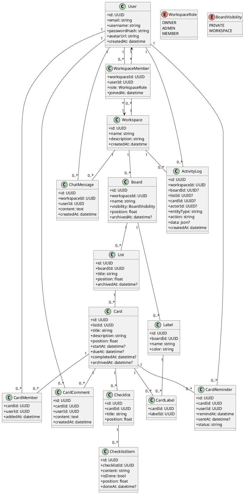

# Class Diagram (Domain Model) — TeamHub

```plantuml
@startuml
skinparam classAttributeIconSize 0

class User {
  +id: UUID
  +email: string
  +username: string
  +passwordHash: string
  +avatarUrl: string
  +createdAt: datetime
}

class Workspace {
  +id: UUID
  +name: string
  +description: string
  +createdAt: datetime
}

class WorkspaceMember {
  +workspaceId: UUID
  +userId: UUID
  +role: WorkspaceRole
  +joinedAt: datetime
}

enum WorkspaceRole {
  OWNER
  ADMIN
  MEMBER
}

class Board {
  +id: UUID
  +workspaceId: UUID
  +name: string
  +visibility: BoardVisibility
  +position: float
  +archivedAt: datetime?
}

enum BoardVisibility {
  PRIVATE
  WORKSPACE
}

class List {
  +id: UUID
  +boardId: UUID
  +title: string
  +position: float
  +archivedAt: datetime?
}

class Card {
  +id: UUID
  +listId: UUID
  +title: string
  +description: string
  +position: float
  +startAt: datetime?
  +dueAt: datetime?
  +completedAt: datetime?
  +archivedAt: datetime?
}

class CardMember {
  +cardId: UUID
  +userId: UUID
  +addedAt: datetime
}

class Label {
  +id: UUID
  +boardId: UUID
  +name: string
  +color: string
}

class CardLabel {
  +cardId: UUID
  +labelId: UUID
}

class Checklist {
  +id: UUID
  +cardId: UUID
  +title: string
  +position: float
}

class ChecklistItem {
  +id: UUID
  +checklistId: UUID
  +content: string
  +isDone: bool
  +position: float
  +doneAt: datetime?
}

class CardComment {
  +id: UUID
  +cardId: UUID
  +userId: UUID
  +content: text
  +createdAt: datetime
}

class CardReminder {
  +id: UUID
  +cardId: UUID
  +userId: UUID
  +remindAt: datetime
  +sentAt: datetime?
  +status: string
}

class ChatMessage {
  +id: UUID
  +workspaceId: UUID
  +userId: UUID
  +content: text
  +createdAt: datetime
}

class ActivityLog {
  +id: UUID
  +workspaceId: UUID
  +boardId: UUID?
  +listId: UUID?
  +cardId: UUID?
  +actorId: UUID?
  +entityType: string
  +action: string
  +data: json?
  +createdAt: datetime
}

User "1" -- "0..*" WorkspaceMember
Workspace "1" -- "0..*" WorkspaceMember
WorkspaceMember "*" --> "1" User
WorkspaceMember "*" --> "1" Workspace

Workspace "1" -- "0..*" Board
Board "1" -- "0..*" List
List "1" -- "0..*" Card

Card "1" -- "0..*" CardComment
User "1" -- "0..*" CardComment

Card "1" -- "0..*" Checklist
Checklist "1" -- "0..*" ChecklistItem

Board "1" -- "0..*" Label
Card "1" -- "0..*" CardLabel
Label "1" -- "0..*" CardLabel

Card "1" -- "0..*" CardMember
User "1" -- "0..*" CardMember

Workspace "1" -- "0..*" ChatMessage
User "1" -- "0..*" ChatMessage

Card "1" -- "0..*" CardReminder
User "1" -- "0..*" CardReminder

Workspace "1" -- "0..*" ActivityLog
User "1" -- "0..*" ActivityLog
@enduml
```