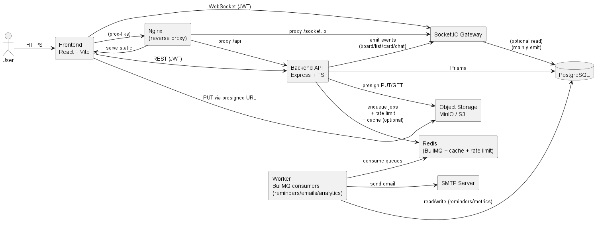
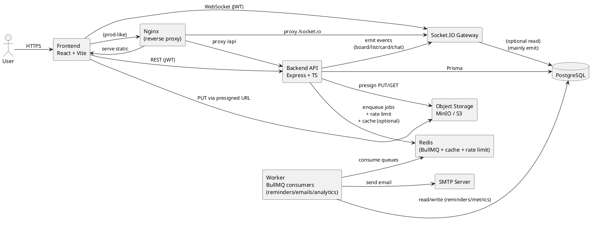

# Component Diagram — TeamHub

> GitHub không render PlantUML mặc định. Hình dưới đây là bản export để xem trực tiếp trên GitHub.

PlantUML source

```plantuml
@startuml
skinparam componentStyle rectangle
left to right direction

actor "User" as User

component "Frontend\nReact + Vite" as FE
component "Nginx\n(reverse proxy)" as NGINX
component "Backend API\nExpress + TS" as API
component "Socket.IO Gateway" as WS
component "Worker\nBullMQ consumers\n(reminders/emails/analytics)" as Worker
database "PostgreSQL" as DB
component "Redis\n(BullMQ + cache + rate limit)" as Redis
component "Object Storage\nMinIO / S3" as S3
component "SMTP Server" as SMTP

User --> FE : HTTPS
FE --> NGINX : (prod-like)
NGINX --> FE : serve static
NGINX --> API : proxy /api
NGINX --> WS : proxy /socket.io

FE --> API : REST (JWT)
FE --> WS : WebSocket (JWT)

API --> DB : Prisma
API --> Redis : enqueue jobs\n+ rate limit\n+ cache (optional)
API --> S3 : presign PUT/GET
WS --> DB : (optional read)\n(mainly emit)
Worker --> Redis : consume queues
Worker --> DB : read/write (reminders/metrics)
Worker --> SMTP : send email

FE --> S3 : PUT via presigned URL

API --> WS : emit events\n(board/list/card/chat)

@enduml
```

