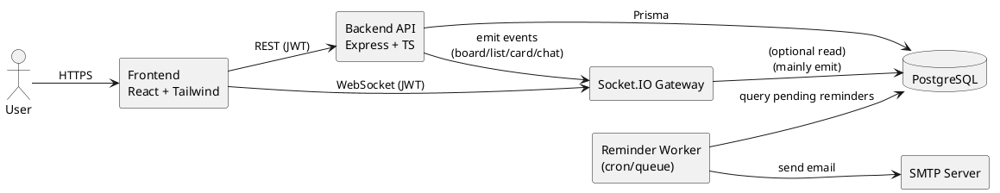

# Component Diagram — TeamHub

```plantuml
@startuml
skinparam componentStyle rectangle
left to right direction

actor "User" as User

component "Frontend\nReact + Tailwind" as FE
component "Backend API\nExpress + TS" as API
component "Socket.IO Gateway" as WS
component "Reminder Worker\n(cron/queue)" as Worker
database "PostgreSQL" as DB
component "SMTP Server" as SMTP

User --> FE : HTTPS
FE --> API : REST (JWT)
FE --> WS : WebSocket (JWT)

API --> DB : Prisma
WS --> DB : (optional read)\n(mainly emit)
Worker --> DB : query pending reminders
Worker --> SMTP : send email

API --> WS : emit events\n(board/list/card/chat)

@enduml
```