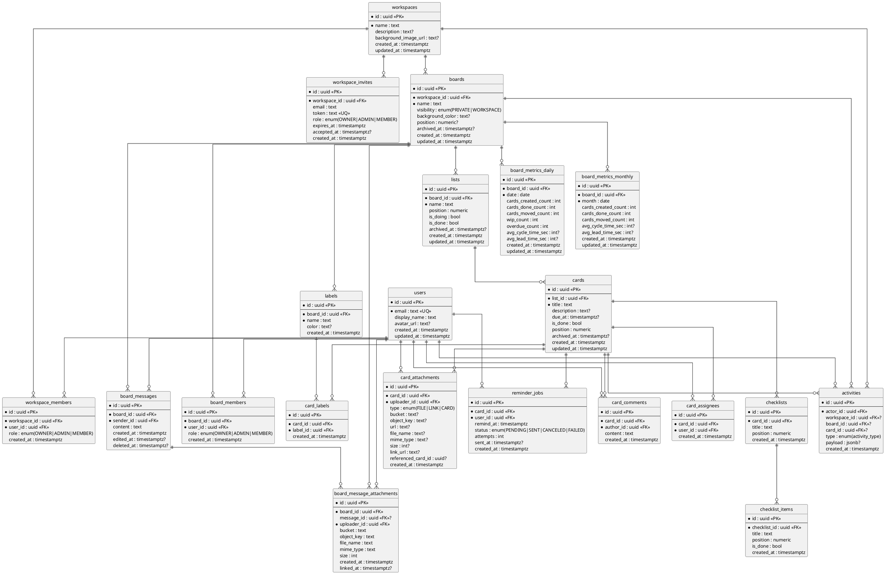

# Database Diagram (ERD) — TeamHub

```plantuml
@startuml
hide circle
skinparam linetype ortho

entity "users" as users {
  * id : uuid <<PK>>
  --
  * email : text <<UQ>>
  display_name : text
  avatar_url : text?
  created_at : timestamptz
  updated_at : timestamptz
}

entity "workspaces" as workspaces {
  * id : uuid <<PK>>
  --
  * name : text
  description : text?
  background_image_url : text?
  created_at : timestamptz
  updated_at : timestamptz
}

entity "workspace_members" as workspace_members {
  * id : uuid <<PK>>
  --
  * workspace_id : uuid <<FK>>
  * user_id : uuid <<FK>>
  role : enum(OWNER|ADMIN|MEMBER)
  created_at : timestamptz
}

entity "workspace_invites" as workspace_invites {
  * id : uuid <<PK>>
  --
  * workspace_id : uuid <<FK>>
  email : text
  token : text <<UQ>>
  role : enum(OWNER|ADMIN|MEMBER)
  expires_at : timestamptz
  accepted_at : timestamptz?
  created_at : timestamptz
}

entity "boards" as boards {
  * id : uuid <<PK>>
  --
  * workspace_id : uuid <<FK>>
  * name : text
  visibility : enum(PRIVATE|WORKSPACE)
  background_color : text?
  position : numeric?
  archived_at : timestamptz?
  created_at : timestamptz
  updated_at : timestamptz
}

entity "board_members" as board_members {
  * id : uuid <<PK>>
  --
  * board_id : uuid <<FK>>
  * user_id : uuid <<FK>>
  role : enum(OWNER|ADMIN|MEMBER)
  created_at : timestamptz
}

entity "lists" as lists {
  * id : uuid <<PK>>
  --
  * board_id : uuid <<FK>>
  * name : text
  position : numeric
  is_doing : bool
  is_done : bool
  archived_at : timestamptz?
  created_at : timestamptz
  updated_at : timestamptz
}

entity "cards" as cards {
  * id : uuid <<PK>>
  --
  * list_id : uuid <<FK>>
  * title : text
  description : text?
  due_at : timestamptz?
  is_done : bool
  position : numeric
  archived_at : timestamptz?
  created_at : timestamptz
  updated_at : timestamptz
}

entity "card_comments" as card_comments {
  * id : uuid <<PK>>
  --
  * card_id : uuid <<FK>>
  * author_id : uuid <<FK>>
  content : text
  created_at : timestamptz
}

entity "card_assignees" as card_assignees {
  * id : uuid <<PK>>
  --
  * card_id : uuid <<FK>>
  * user_id : uuid <<FK>>
  created_at : timestamptz
}

entity "labels" as labels {
  * id : uuid <<PK>>
  --
  * board_id : uuid <<FK>>
  * name : text
  color : text?
  created_at : timestamptz
}

entity "card_labels" as card_labels {
  * id : uuid <<PK>>
  --
  * card_id : uuid <<FK>>
  * label_id : uuid <<FK>>
  created_at : timestamptz
}

entity "checklists" as checklists {
  * id : uuid <<PK>>
  --
  * card_id : uuid <<FK>>
  title : text
  position : numeric
  created_at : timestamptz
}

entity "checklist_items" as checklist_items {
  * id : uuid <<PK>>
  --
  * checklist_id : uuid <<FK>>
  title : text
  position : numeric
  is_done : bool
  created_at : timestamptz
}

entity "card_attachments" as card_attachments {
  * id : uuid <<PK>>
  --
  * card_id : uuid <<FK>>
  * uploader_id : uuid <<FK>>
  type : enum(FILE|LINK|CARD)
  bucket : text?
  object_key : text?
  url : text?
  file_name : text?
  mime_type : text?
  size : int?
  link_url : text?
  referenced_card_id : uuid?
  created_at : timestamptz
}

entity "reminder_jobs" as reminder_jobs {
  * id : uuid <<PK>>
  --
  * card_id : uuid <<FK>>
  * user_id : uuid <<FK>>
  remind_at : timestamptz
  status : enum(PENDING|SENT|CANCELED|FAILED)
  attempts : int
  sent_at : timestamptz?
  created_at : timestamptz
}

entity "activities" as activities {
  * id : uuid <<PK>>
  --
  * actor_id : uuid <<FK>>
  workspace_id : uuid <<FK>>?
  board_id : uuid <<FK>>?
  card_id : uuid <<FK>>?
  type : enum(activity_type)
  payload : jsonb?
  created_at : timestamptz
}

entity "board_messages" as board_messages {
  * id : uuid <<PK>>
  --
  * board_id : uuid <<FK>>
  * sender_id : uuid <<FK>>
  content : text
  created_at : timestamptz
  edited_at : timestamptz?
  deleted_at : timestamptz?
}

entity "board_message_attachments" as board_message_attachments {
  * id : uuid <<PK>>
  --
  * board_id : uuid <<FK>>
  message_id : uuid <<FK>>?
  * uploader_id : uuid <<FK>>
  bucket : text
  object_key : text
  file_name : text
  mime_type : text
  size : int
  created_at : timestamptz
  linked_at : timestamptz?
}

entity "board_metrics_daily" as board_metrics_daily {
  * id : uuid <<PK>>
  --
  * board_id : uuid <<FK>>
  * date : date
  cards_created_count : int
  cards_done_count : int
  cards_moved_count : int
  wip_count : int
  overdue_count : int
  avg_cycle_time_sec : int?
  avg_lead_time_sec : int?
  created_at : timestamptz
  updated_at : timestamptz
}

entity "board_metrics_monthly" as board_metrics_monthly {
  * id : uuid <<PK>>
  --
  * board_id : uuid <<FK>>
  * month : date
  cards_created_count : int
  cards_done_count : int
  cards_moved_count : int
  avg_cycle_time_sec : int?
  avg_lead_time_sec : int?
  created_at : timestamptz
  updated_at : timestamptz
}

users ||--o{ workspace_members
workspaces ||--o{ workspace_members

workspaces ||--o{ workspace_invites

workspaces ||--o{ boards
boards ||--o{ board_members
users ||--o{ board_members

boards ||--o{ lists
lists ||--o{ cards

cards ||--o{ card_comments
users ||--o{ card_comments

cards ||--o{ card_assignees
users ||--o{ card_assignees

boards ||--o{ labels
cards ||--o{ card_labels
labels ||--o{ card_labels

cards ||--o{ checklists
checklists ||--o{ checklist_items

cards ||--o{ card_attachments
users ||--o{ card_attachments

cards ||--o{ reminder_jobs
users ||--o{ reminder_jobs

users ||--o{ activities
workspaces ||--o{ activities
boards ||--o{ activities
cards ||--o{ activities

boards ||--o{ board_messages
users ||--o{ board_messages
boards ||--o{ board_message_attachments
users ||--o{ board_message_attachments
board_messages ||--o{ board_message_attachments

boards ||--o{ board_metrics_daily
boards ||--o{ board_metrics_monthly
@enduml
```