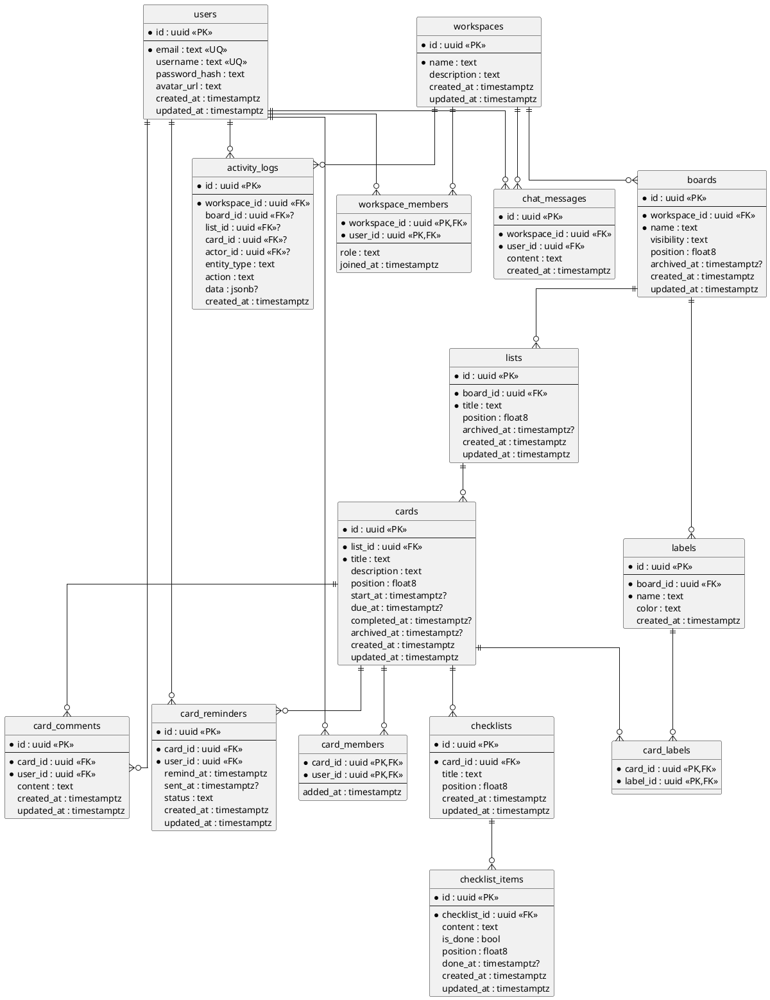

# Database Diagram (ERD) — TeamHub

```plantuml
@startuml
hide circle
skinparam linetype ortho

entity "users" as users {
  * id : uuid <<PK>>
  --
  * email : text <<UQ>>
  username : text <<UQ>>
  password_hash : text
  avatar_url : text
  created_at : timestamptz
  updated_at : timestamptz
}

entity "workspaces" as workspaces {
  * id : uuid <<PK>>
  --
  * name : text
  description : text
  created_at : timestamptz
  updated_at : timestamptz
}

entity "workspace_members" as workspace_members {
  * workspace_id : uuid <<PK,FK>>
  * user_id : uuid <<PK,FK>>
  --
  role : text
  joined_at : timestamptz
}

entity "boards" as boards {
  * id : uuid <<PK>>
  --
  * workspace_id : uuid <<FK>>
  * name : text
  visibility : text
  position : float8
  archived_at : timestamptz?
  created_at : timestamptz
  updated_at : timestamptz
}

entity "lists" as lists {
  * id : uuid <<PK>>
  --
  * board_id : uuid <<FK>>
  * title : text
  position : float8
  archived_at : timestamptz?
  created_at : timestamptz
  updated_at : timestamptz
}

entity "cards" as cards {
  * id : uuid <<PK>>
  --
  * list_id : uuid <<FK>>
  * title : text
  description : text
  position : float8
  start_at : timestamptz?
  due_at : timestamptz?
  completed_at : timestamptz?
  archived_at : timestamptz?
  created_at : timestamptz
  updated_at : timestamptz
}

entity "card_members" as card_members {
  * card_id : uuid <<PK,FK>>
  * user_id : uuid <<PK,FK>>
  --
  added_at : timestamptz
}

entity "labels" as labels {
  * id : uuid <<PK>>
  --
  * board_id : uuid <<FK>>
  * name : text
  color : text
  created_at : timestamptz
}

entity "card_labels" as card_labels {
  * card_id : uuid <<PK,FK>>
  * label_id : uuid <<PK,FK>>
}

entity "checklists" as checklists {
  * id : uuid <<PK>>
  --
  * card_id : uuid <<FK>>
  title : text
  position : float8
  created_at : timestamptz
  updated_at : timestamptz
}

entity "checklist_items" as checklist_items {
  * id : uuid <<PK>>
  --
  * checklist_id : uuid <<FK>>
  content : text
  is_done : bool
  position : float8
  done_at : timestamptz?
  created_at : timestamptz
  updated_at : timestamptz
}

entity "card_comments" as card_comments {
  * id : uuid <<PK>>
  --
  * card_id : uuid <<FK>>
  * user_id : uuid <<FK>>
  content : text
  created_at : timestamptz
  updated_at : timestamptz
}

entity "card_reminders" as card_reminders {
  * id : uuid <<PK>>
  --
  * card_id : uuid <<FK>>
  * user_id : uuid <<FK>>
  remind_at : timestamptz
  sent_at : timestamptz?
  status : text
  created_at : timestamptz
  updated_at : timestamptz
}

entity "chat_messages" as chat_messages {
  * id : uuid <<PK>>
  --
  * workspace_id : uuid <<FK>>
  * user_id : uuid <<FK>>
  content : text
  created_at : timestamptz
}

entity "activity_logs" as activity_logs {
  * id : uuid <<PK>>
  --
  * workspace_id : uuid <<FK>>
  board_id : uuid <<FK>>?
  list_id : uuid <<FK>>?
  card_id : uuid <<FK>>?
  actor_id : uuid <<FK>>?
  entity_type : text
  action : text
  data : jsonb?
  created_at : timestamptz
}

users ||--o{ workspace_members
workspaces ||--o{ workspace_members

workspaces ||--o{ boards
boards ||--o{ lists
lists ||--o{ cards

cards ||--o{ card_members
users ||--o{ card_members

boards ||--o{ labels
cards ||--o{ card_labels
labels ||--o{ card_labels

cards ||--o{ checklists
checklists ||--o{ checklist_items

cards ||--o{ card_comments
users ||--o{ card_comments

cards ||--o{ card_reminders
users ||--o{ card_reminders

workspaces ||--o{ chat_messages
users ||--o{ chat_messages

workspaces ||--o{ activity_logs
users ||--o{ activity_logs
@enduml
```