# Sequence Diagrams — TeamHub (GitHub-friendly)

Tài liệu này ưu tiên **ảnh export** (đặt trong `docs/screenshots/`) để tránh lỗi render trên các Markdown viewer khác nhau.
Mỗi diagram có:
- Ảnh PNG (sau khi bạn export)
- Source PlantUML (để regenerate ảnh)

---

## 1) Create/Move Card (REST + Realtime)

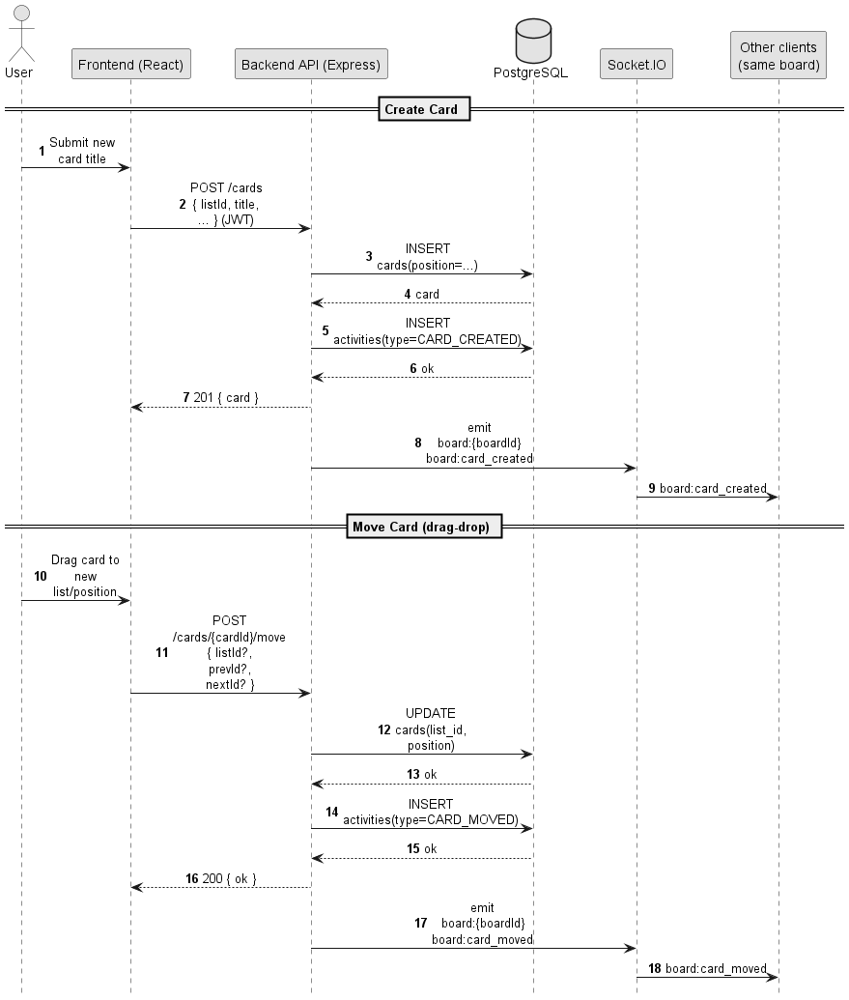

PlantUML source

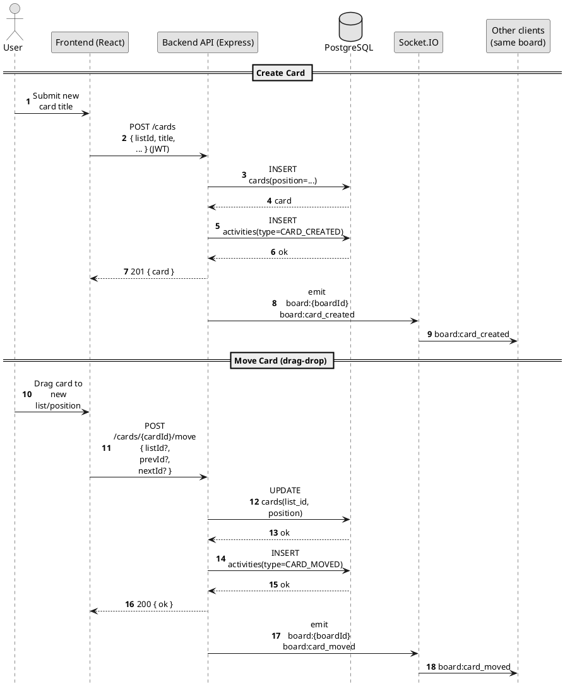
```plantuml
@startuml
!pragma teoz true
autonumber
hide footbox

skinparam shadowing false
skinparam monochrome true
skinparam sequenceMessageAlign center
skinparam ParticipantPadding 18
skinparam BoxPadding 14
skinparam maxMessageSize 80

actor "User" as U
participant "Frontend (React)" as FE
participant "Backend API (Express)" as API
database "PostgreSQL" as DB
participant "Socket.IO" as WS
participant "Other clients\n(same board)" as OC

== Create Card ==
U -> FE: Submit new card title
FE -> API: POST /cards { listId, title, ... } (JWT)
API -> DB: INSERT cards(position=...)
DB --> API: card
API -> DB: INSERT activities(type=CARD_CREATED)
DB --> API: ok
API --> FE: 201 { card }

API -> WS: emit board:{boardId}\nboard:card_created
WS -> OC: board:card_created

== Move Card (drag-drop) ==
U -> FE: Drag card to new list/position
FE -> API: POST /cards/{cardId}/move\n{ listId?, prevId?, nextId? }
API -> DB: UPDATE cards(list_id, position)
DB --> API: ok
API -> DB: INSERT activities(type=CARD_MOVED)
DB --> API: ok
API --> FE: 200 { ok }

API -> WS: emit board:{boardId}\nboard:card_moved
WS -> OC: board:card_moved
@enduml
```

---

## 2) Auth — Login + Refresh Rotation + Logout (cookie)

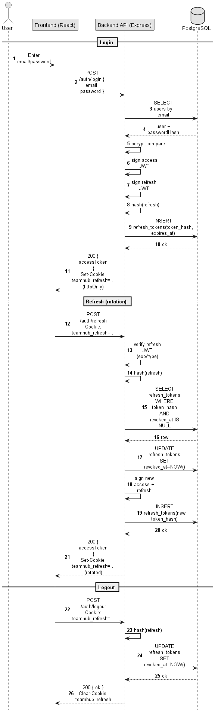

PlantUML source

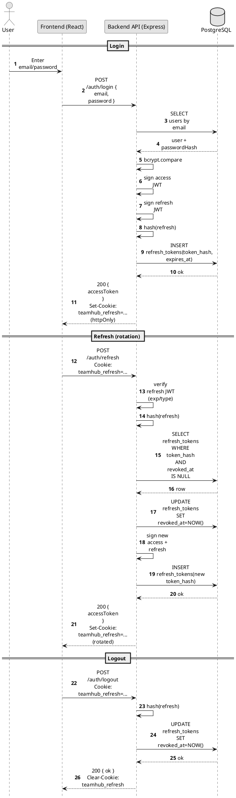
```plantuml
@startuml
!pragma teoz true
autonumber
hide footbox

skinparam shadowing false
skinparam monochrome true
skinparam sequenceMessageAlign center
skinparam ParticipantPadding 18
skinparam BoxPadding 14
skinparam maxMessageSize 80

actor "User" as U
participant "Frontend (React)" as FE
participant "Backend API (Express)" as API
database "PostgreSQL" as DB

== Login ==
U -> FE: Enter email/password
FE -> API: POST /auth/login { email, password }
API -> DB: SELECT users by email
DB --> API: user + passwordHash
API -> API: bcrypt.compare
API -> API: sign access JWT
API -> API: sign refresh JWT
API -> API: hash(refresh)
API -> DB: INSERT refresh_tokens(token_hash, expires_at)
DB --> API: ok
API --> FE: 200 { accessToken }\nSet-Cookie: teamhub_refresh=... (httpOnly)

== Refresh (rotation) ==
FE -> API: POST /auth/refresh\nCookie: teamhub_refresh=...
API -> API: verify refresh JWT (exp/type)
API -> API: hash(refresh)
API -> DB: SELECT refresh_tokens WHERE token_hash AND revoked_at IS NULL
DB --> API: row
API -> DB: UPDATE refresh_tokens SET revoked_at=NOW()
API -> API: sign new access + refresh
API -> DB: INSERT refresh_tokens(new token_hash)
DB --> API: ok
API --> FE: 200 { accessToken }\nSet-Cookie: teamhub_refresh=... (rotated)

== Logout ==
FE -> API: POST /auth/logout\nCookie: teamhub_refresh=...
API -> API: hash(refresh)
API -> DB: UPDATE refresh_tokens SET revoked_at=NOW()
DB --> API: ok
API --> FE: 200 { ok }\nClear-Cookie: teamhub_refresh
@enduml
```

---

## 3) Invites — Inbox Accept + Accept-by-token

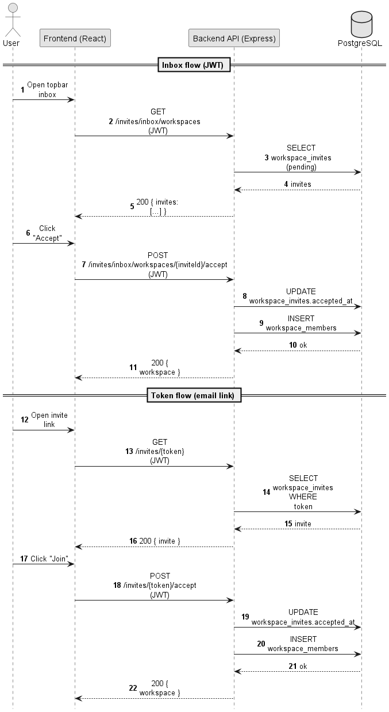

PlantUML source

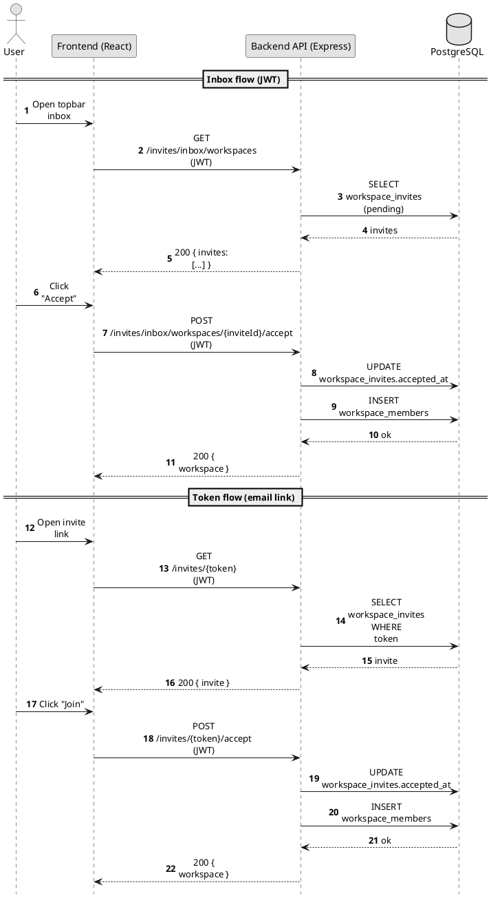
```plantuml
@startuml
!pragma teoz true
autonumber
hide footbox

skinparam shadowing false
skinparam monochrome true
skinparam sequenceMessageAlign center
skinparam ParticipantPadding 18
skinparam BoxPadding 14
skinparam maxMessageSize 80

actor "User" as U
participant "Frontend (React)" as FE
participant "Backend API (Express)" as API
database "PostgreSQL" as DB

== Inbox flow (JWT) ==
U -> FE: Open topbar inbox
FE -> API: GET /invites/inbox/workspaces (JWT)
API -> DB: SELECT workspace_invites (pending)
DB --> API: invites
API --> FE: 200 { invites: [...] }

U -> FE: Click "Accept"
FE -> API: POST /invites/inbox/workspaces/{inviteId}/accept (JWT)
API -> DB: UPDATE workspace_invites.accepted_at
API -> DB: INSERT workspace_members
DB --> API: ok
API --> FE: 200 { workspace }

== Token flow (email link) ==
U -> FE: Open invite link
FE -> API: GET /invites/{token} (JWT)
API -> DB: SELECT workspace_invites WHERE token
DB --> API: invite
API --> FE: 200 { invite }

U -> FE: Click "Join"
FE -> API: POST /invites/{token}/accept (JWT)
API -> DB: UPDATE workspace_invites.accepted_at
API -> DB: INSERT workspace_members
DB --> API: ok
API --> FE: 200 { workspace }
@enduml
```

---

## 4) Attachment Upload — Presign PUT + Commit

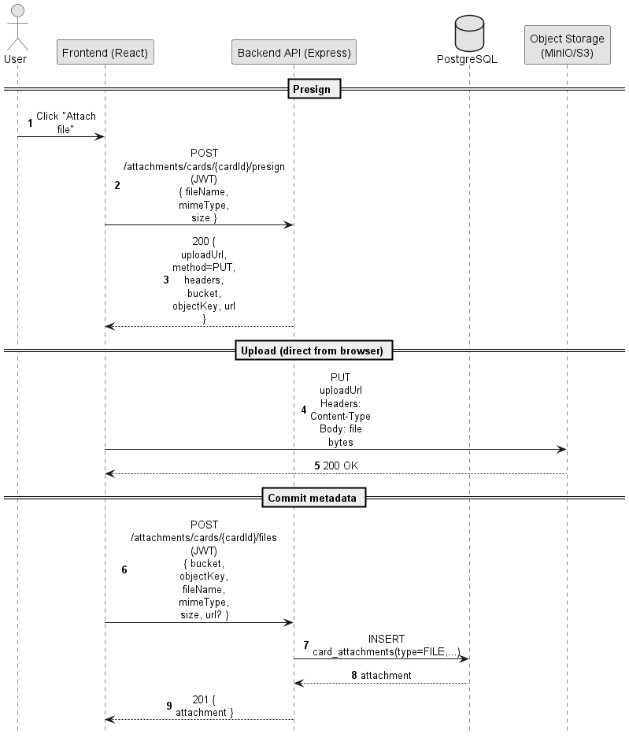

PlantUML source

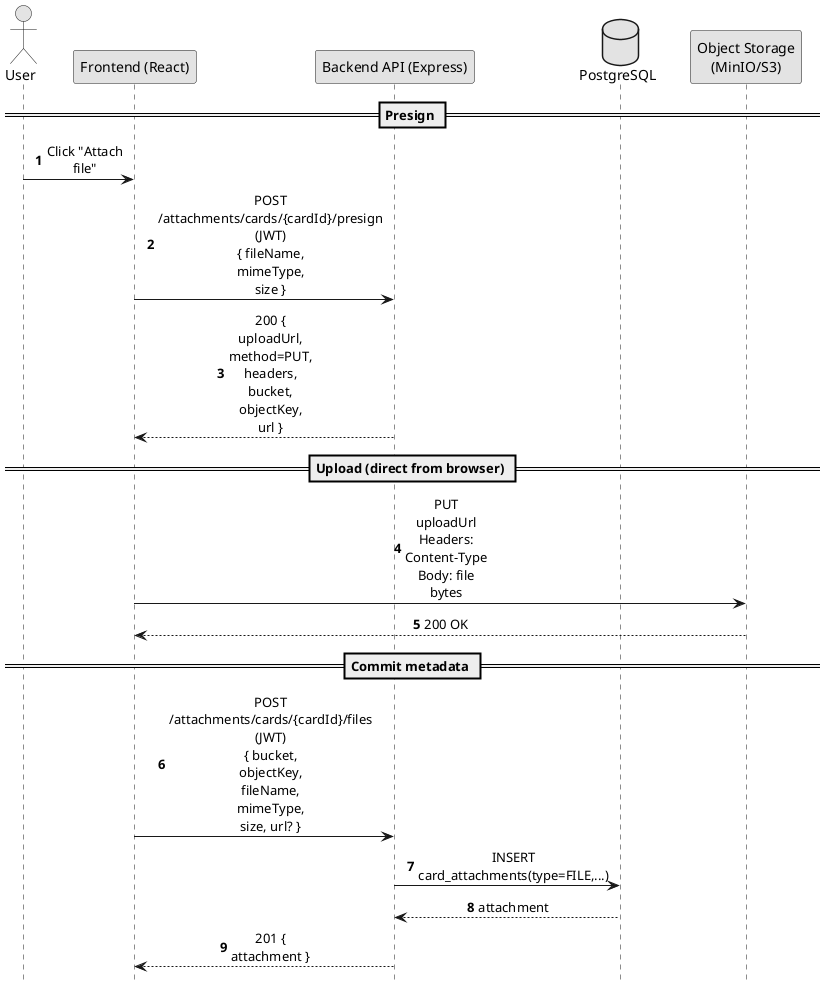
```plantuml
@startuml
!pragma teoz true
autonumber
hide footbox

skinparam shadowing false
skinparam monochrome true
skinparam sequenceMessageAlign center
skinparam ParticipantPadding 18
skinparam BoxPadding 14
skinparam maxMessageSize 80

actor "User" as U
participant "Frontend (React)" as FE
participant "Backend API (Express)" as API
database "PostgreSQL" as DB
participant "Object Storage\n(MinIO/S3)" as S3

== Presign ==
U -> FE: Click "Attach file"
FE -> API: POST /attachments/cards/{cardId}/presign (JWT)\n{ fileName, mimeType, size }
API --> FE: 200 { uploadUrl, method=PUT, headers, bucket, objectKey, url }

== Upload (direct from browser) ==
FE -> S3: PUT uploadUrl\nHeaders: Content-Type\nBody: file bytes
S3 --> FE: 200 OK

== Commit metadata ==
FE -> API: POST /attachments/cards/{cardId}/files (JWT)\n{ bucket, objectKey, fileName, mimeType, size, url? }
API -> DB: INSERT card_attachments(type=FILE,...)
DB --> API: attachment
API --> FE: 201 { attachment }
@enduml
```

---

## 5) Workspace Background Upload — Init (presign) + PUT + Commit

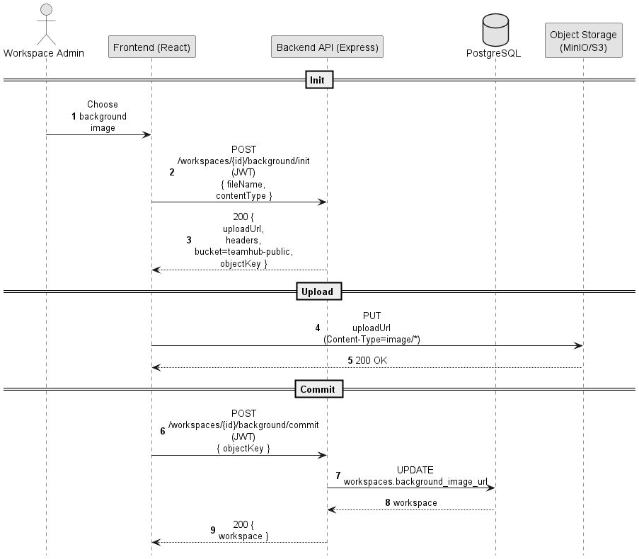

PlantUML source

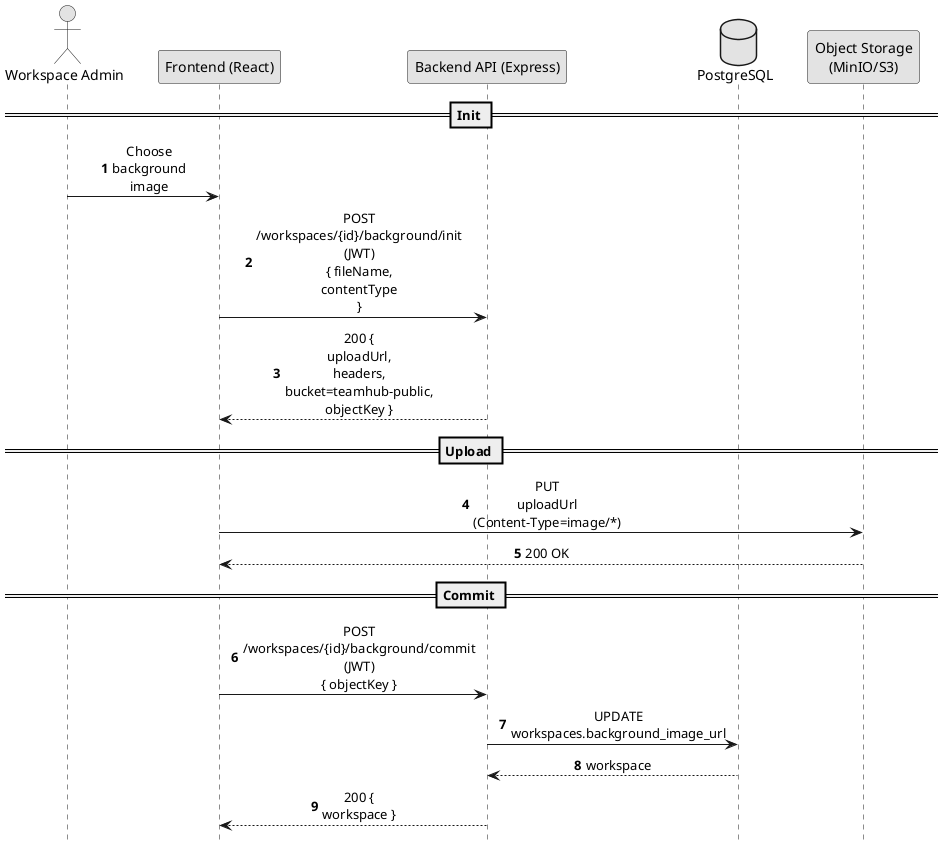
```plantuml
@startuml
!pragma teoz true
autonumber
hide footbox

skinparam shadowing false
skinparam monochrome true
skinparam sequenceMessageAlign center
skinparam ParticipantPadding 18
skinparam BoxPadding 14
skinparam maxMessageSize 80

actor "Workspace Admin" as U
participant "Frontend (React)" as FE
participant "Backend API (Express)" as API
database "PostgreSQL" as DB
participant "Object Storage\n(MinIO/S3)" as S3

== Init ==
U -> FE: Choose background image
FE -> API: POST /workspaces/{id}/background/init (JWT)\n{ fileName, contentType }
API --> FE: 200 { uploadUrl, headers, bucket=teamhub-public, objectKey }

== Upload ==
FE -> S3: PUT uploadUrl\n(Content-Type=image/*)
S3 --> FE: 200 OK

== Commit ==
FE -> API: POST /workspaces/{id}/background/commit (JWT)\n{ objectKey }
API -> DB: UPDATE workspaces.background_image_url
DB --> API: workspace
API --> FE: 200 { workspace }
@enduml
```

---

## 6) Avatar Upload — Init (presign) + PUT + Commit

PlantUML source

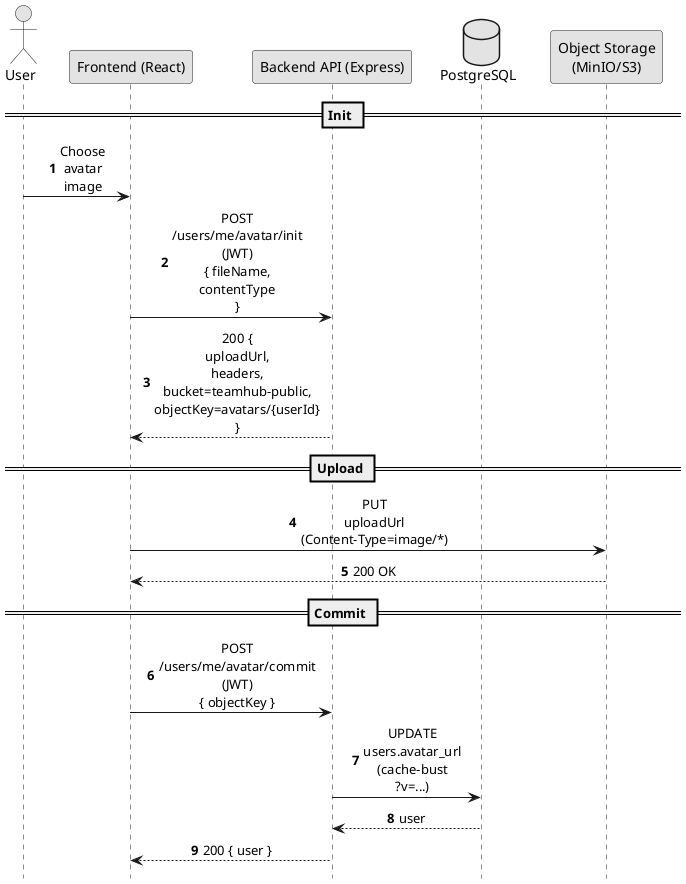
```plantuml
@startuml
!pragma teoz true
autonumber
hide footbox

skinparam shadowing false
skinparam monochrome true
skinparam sequenceMessageAlign center
skinparam ParticipantPadding 18
skinparam BoxPadding 14
skinparam maxMessageSize 80

actor "User" as U
participant "Frontend (React)" as FE
participant "Backend API (Express)" as API
database "PostgreSQL" as DB
participant "Object Storage\n(MinIO/S3)" as S3

== Init ==
U -> FE: Choose avatar image
FE -> API: POST /users/me/avatar/init (JWT)\n{ fileName, contentType }
API --> FE: 200 { uploadUrl, headers, bucket=teamhub-public, objectKey=avatars/{userId} }

== Upload ==
FE -> S3: PUT uploadUrl\n(Content-Type=image/*)
S3 --> FE: 200 OK

== Commit ==
FE -> API: POST /users/me/avatar/commit (JWT)\n{ objectKey }
API -> DB: UPDATE users.avatar_url (cache-bust ?v=...)
DB --> API: user
API --> FE: 200 { user }
@enduml
```

---

## 7) Reminder Email — Set Reminder → BullMQ delayed → Worker sends SMTP

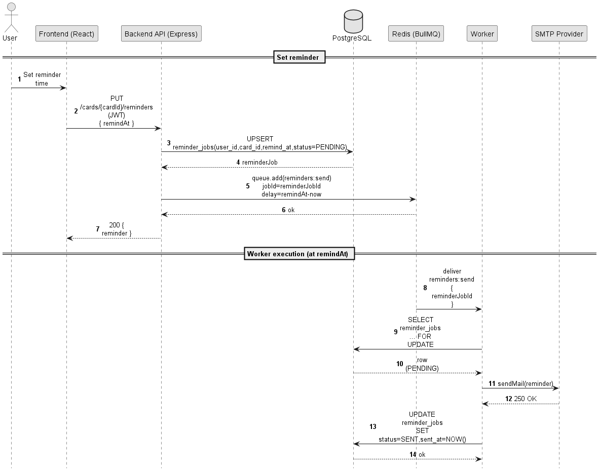

PlantUML source

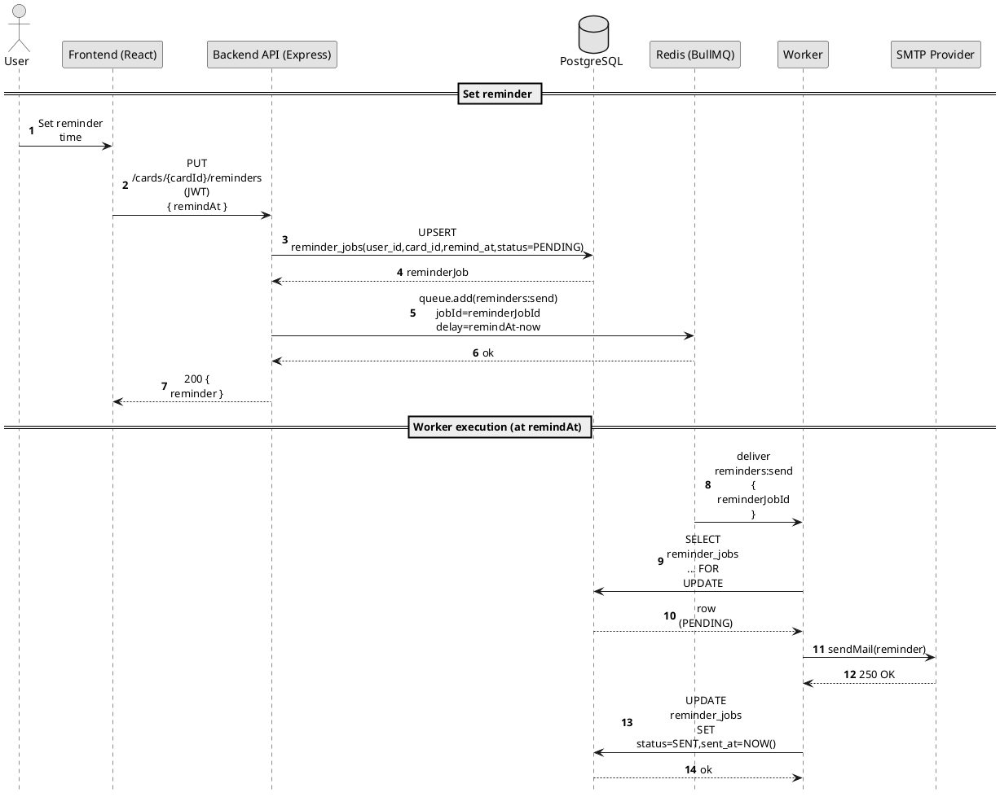
```plantuml
@startuml
!pragma teoz true
autonumber
hide footbox

skinparam shadowing false
skinparam monochrome true
skinparam sequenceMessageAlign center
skinparam ParticipantPadding 18
skinparam BoxPadding 14
skinparam maxMessageSize 80

actor "User" as U
participant "Frontend (React)" as FE
participant "Backend API (Express)" as API
database "PostgreSQL" as DB
participant "Redis (BullMQ)" as R
participant "Worker" as W
participant "SMTP Provider" as SMTP

== Set reminder ==
U -> FE: Set reminder time
FE -> API: PUT /cards/{cardId}/reminders (JWT)\n{ remindAt }
API -> DB: UPSERT reminder_jobs(user_id,card_id,remind_at,status=PENDING)
DB --> API: reminderJob
API -> R: queue.add(reminders:send)\njobId=reminderJobId\ndelay=remindAt-now
R --> API: ok
API --> FE: 200 { reminder }

== Worker execution (at remindAt) ==
R -> W: deliver reminders:send { reminderJobId }
W -> DB: SELECT reminder_jobs ... FOR UPDATE
DB --> W: row (PENDING)
W -> SMTP: sendMail(reminder)
SMTP --> W: 250 OK
W -> DB: UPDATE reminder_jobs SET status=SENT,sent_at=NOW()
DB --> W: ok
@enduml
```

---

## 8) Blob Delete — API enqueue → Worker removeObjectSafe (MinIO)

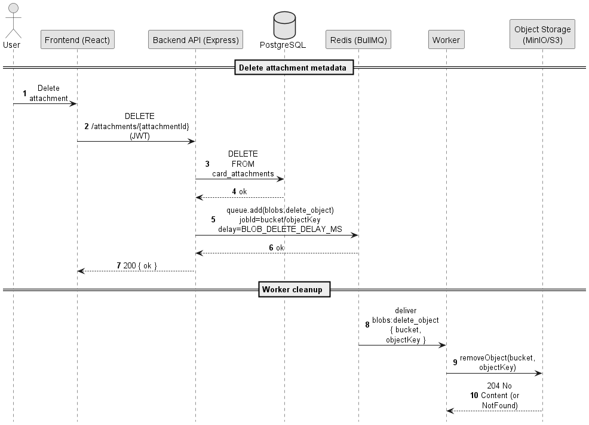

PlantUML source

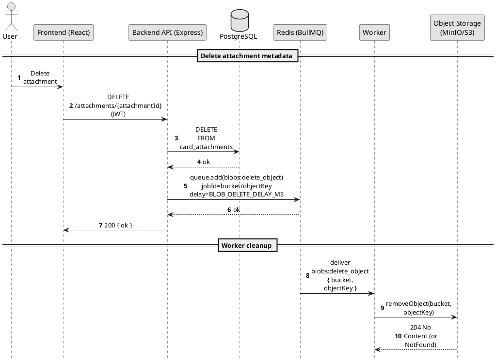
```plantuml
@startuml
!pragma teoz true
autonumber
hide footbox

skinparam shadowing false
skinparam monochrome true
skinparam sequenceMessageAlign center
skinparam ParticipantPadding 18
skinparam BoxPadding 14
skinparam maxMessageSize 80

actor "User" as U
participant "Frontend (React)" as FE
participant "Backend API (Express)" as API
database "PostgreSQL" as DB
participant "Redis (BullMQ)" as R
participant "Worker" as W
participant "Object Storage\n(MinIO/S3)" as S3

== Delete attachment metadata ==
U -> FE: Delete attachment
FE -> API: DELETE /attachments/{attachmentId} (JWT)
API -> DB: DELETE FROM card_attachments
DB --> API: ok
API -> R: queue.add(blobs:delete_object)\njobId=bucket/objectKey\ndelay=BLOB_DELETE_DELAY_MS
R --> API: ok
API --> FE: 200 { ok }

== Worker cleanup ==
R -> W: deliver blobs:delete_object\n{ bucket, objectKey }
W -> S3: removeObject(bucket, objectKey)
S3 --> W: 204 No Content (or NotFound)
@enduml
```

---

## 9) Analytics Daily Rollup (BullMQ)

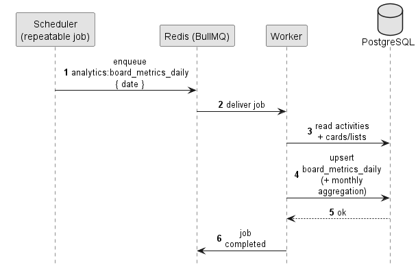

PlantUML source

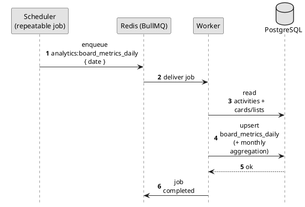
```plantuml
@startuml
!pragma teoz true
autonumber
hide footbox

skinparam shadowing false
skinparam monochrome true
skinparam sequenceMessageAlign center
skinparam ParticipantPadding 18
skinparam BoxPadding 14
skinparam maxMessageSize 80

participant "Scheduler\n(repeatable job)" as SCH
participant "Redis (BullMQ)" as R
participant "Worker" as W
database "PostgreSQL" as DB

SCH -> R: enqueue analytics:board_metrics_daily\n{ date }
R -> W: deliver job
W -> DB: read activities + cards/lists
W -> DB: upsert board_metrics_daily\n(+ monthly aggregation)
DB --> W: ok
W -> R: job completed
@enduml
```

