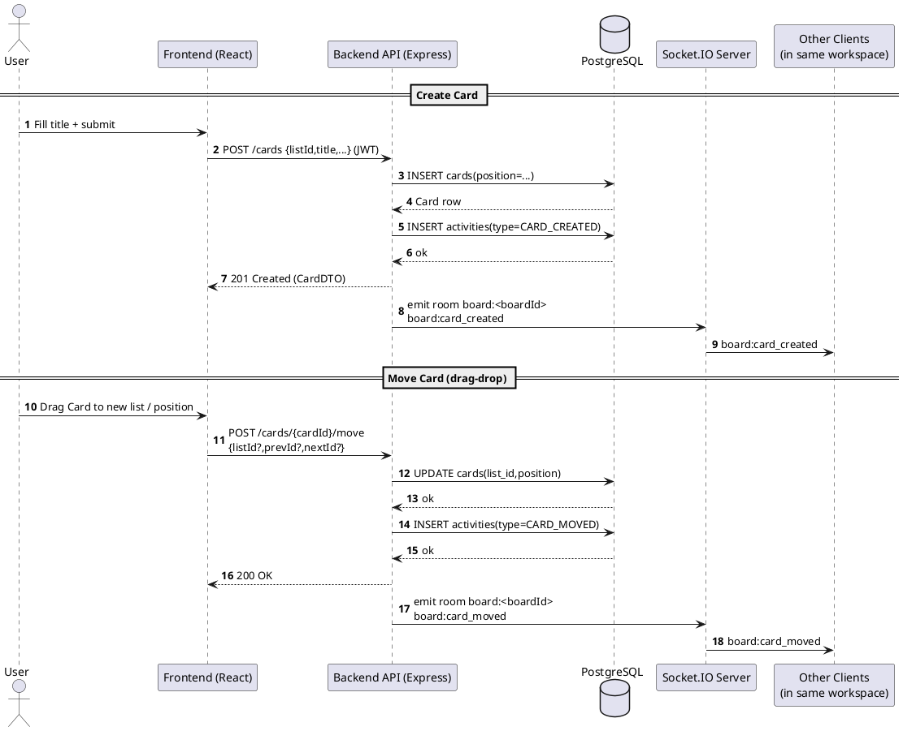
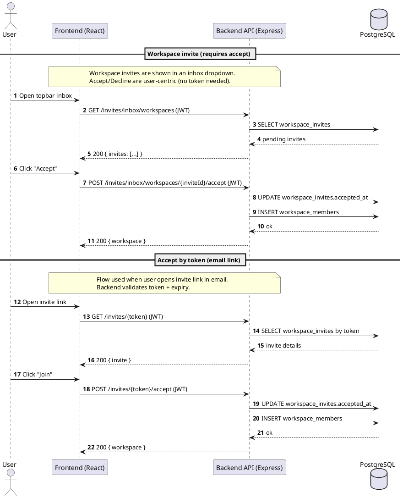
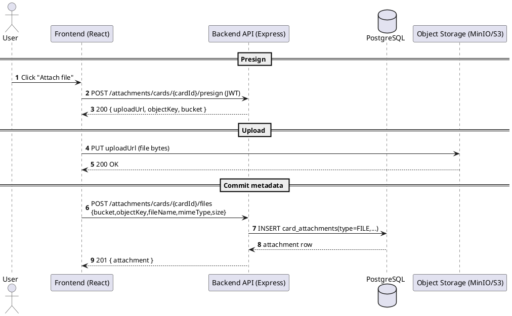
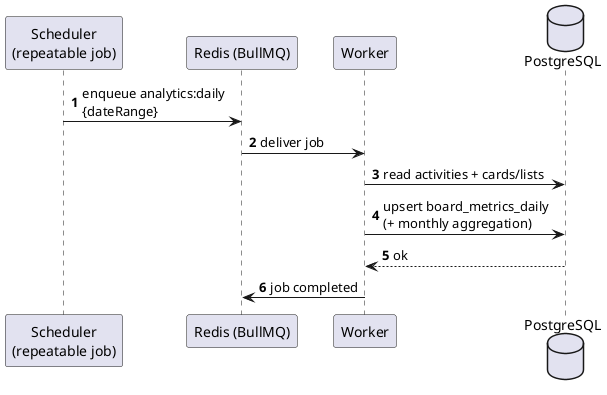

# Sequence Diagram — Create/Move Card (REST + Realtime)

## Sequence Diagram — Invites (Workspace inbox + Accept-by-token)

## Sequence Diagram — Attachment Upload (Presign PUT + Commit)

## Sequence Diagram — Analytics Daily Rollup (BullMQ)

