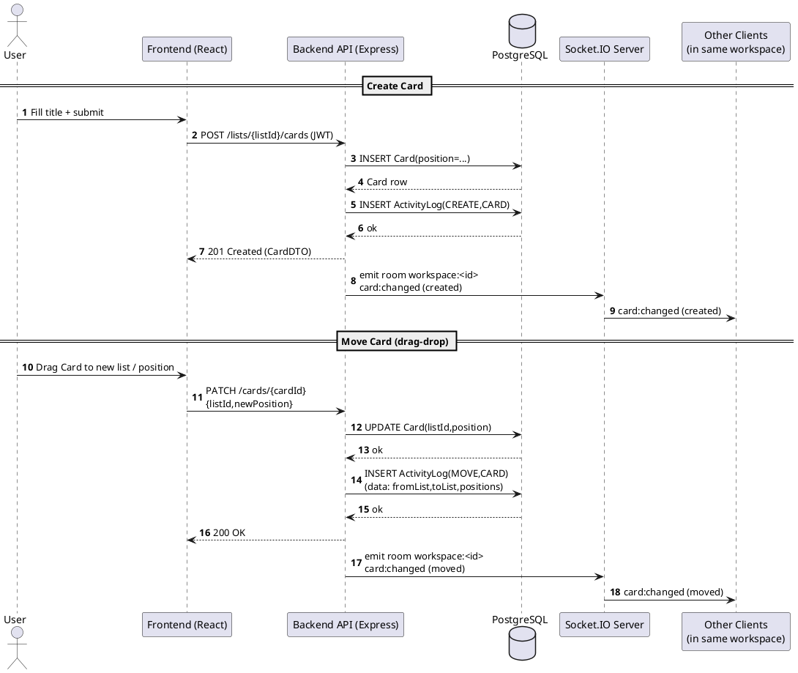

# Sequence Diagram — Create/Move Card (REST + Realtime)

```plantuml
@startuml
autonumber
actor "User" as U
participant "Frontend (React)" as FE
participant "Backend API (Express)" as API
database "PostgreSQL" as DB
participant "Socket.IO Server" as WS
participant "Other Clients\n(in same workspace)" as OC

== Create Card ==
U -> FE: Fill title + submit
FE -> API: POST /lists/{listId}/cards (JWT)
API -> DB: INSERT Card(position=...)
DB --> API: Card row
API -> DB: INSERT ActivityLog(CREATE,CARD)
DB --> API: ok
API --> FE: 201 Created (CardDTO)

API -> WS: emit room workspace:<id>\ncard:changed (created)
WS -> OC: card:changed (created)

== Move Card (drag-drop) ==
U -> FE: Drag Card to new list / position
FE -> API: PATCH /cards/{cardId}\n{listId,newPosition}
API -> DB: UPDATE Card(listId,position)
DB --> API: ok
API -> DB: INSERT ActivityLog(MOVE,CARD)\n(data: fromList,toList,positions)
DB --> API: ok
API --> FE: 200 OK

API -> WS: emit room workspace:<id>\ncard:changed (moved)
WS -> OC: card:changed (moved)
@enduml
```