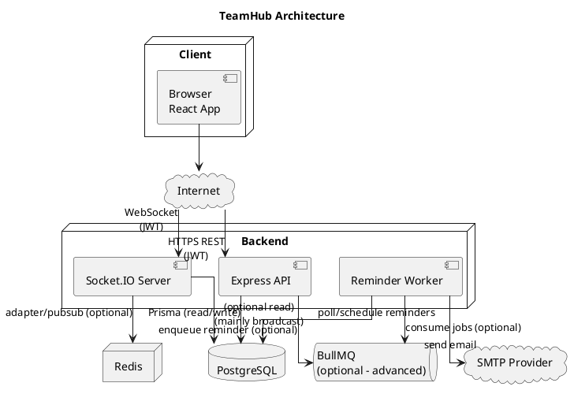

# System Architecture Diagram — TeamHub (MVP + Nâng cao)

```plantuml
@startuml
skinparam linetype ortho
title TeamHub Architecture

node "Client" as client {
  [Browser\nReact App] as browser
}

cloud "Internet" as net

node "Backend" as backend {
  [Express API] as api
  [Socket.IO Server] as sio
  [Reminder Worker] as worker
}

database "PostgreSQL" as pg
queue "BullMQ\n(optional - advanced)" as mq
node "Redis" as redis
cloud "SMTP Provider" as smtp

browser --> net
net --> api : HTTPS REST\n(JWT)
net --> sio : WebSocket\n(JWT)

api --> pg : Prisma (read/write)
sio --> pg : (optional read)\n(mainly broadcast)
worker --> pg : poll/schedule reminders
worker --> smtp : send email

' advanced path
api --> mq : enqueue reminder (optional)
worker --> mq : consume jobs (optional)
sio --> redis : adapter/pubsub (optional)

@enduml
```