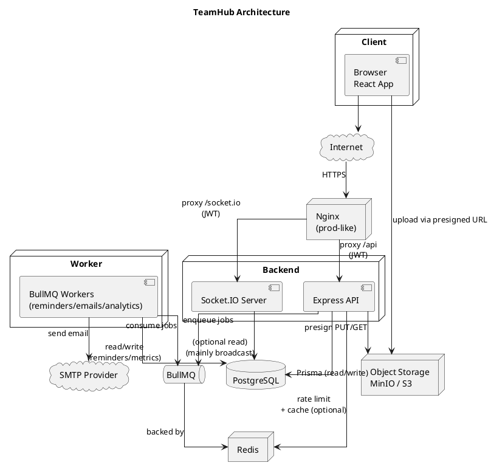

# System Architecture Diagram — TeamHub (MVP + Nâng cao)

> GitHub không render PlantUML mặc định. Hình dưới đây là bản export để xem trực tiếp trên GitHub.

PlantUML source

```plantuml
@startuml
skinparam linetype ortho
title TeamHub Architecture

node "Client" as client {
  [Browser\nReact App] as browser
}

cloud "Internet" as net

node "Backend" as backend {
  [Express API] as api
  [Socket.IO Server] as sio
}

node "Worker" as workerNode {
  [BullMQ Workers\n(reminders/emails/analytics)] as worker
}

database "PostgreSQL" as pg
queue "BullMQ" as mq
node "Redis" as redis
node "Object Storage\nMinIO / S3" as s3
cloud "SMTP Provider" as smtp
node "Nginx\n(prod-like)" as nginx

browser --> net
net --> nginx : HTTPS
nginx --> api : proxy /api\n(JWT)
nginx --> sio : proxy /socket.io\n(JWT)

api --> pg : Prisma (read/write)
sio --> pg : (optional read)\n(mainly broadcast)

api --> mq : enqueue jobs
worker --> mq : consume jobs

worker --> pg : read/write\n(reminders/metrics)
worker --> smtp : send email

api --> s3 : presign PUT/GET
browser --> s3 : upload via presigned URL

mq --> redis : backed by
api --> redis : rate limit\n+ cache (optional)

@enduml
```

