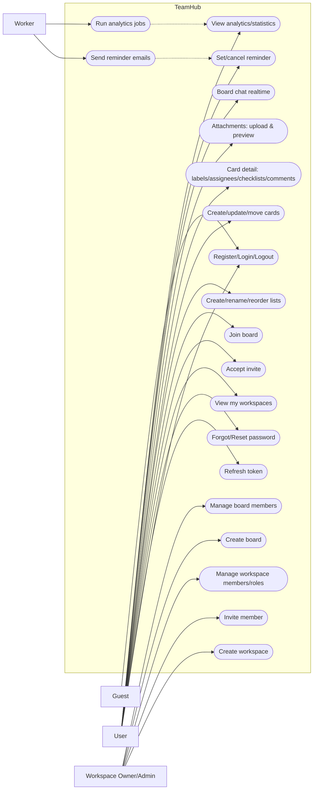

# Use case diagram

Use case diagram dưới đây mô tả các tác nhân chính và nhóm chức năng cốt lõi của TeamHub.

> Gợi ý: GitHub Markdown render được Mermaid. Nếu nơi bạn xem không render, hãy copy block `mermaid` sang công cụ Mermaid Live Editor.

## Mapping nhanh use case → màn hình UI
- Home: UC_WS_List
- Workspace: UC_WS_Create, UC_WS_Invite
- Workspace member: UC_WS_Roles
- Board: UC_Lists, UC_Cards
- Board member: UC_Board_Members
- Dialog accept lời mời: UC_WS_Accept
- Card detail: UC_Card_Detail, UC_Attach, UC_Reminder
- Thống kê: UC_Analytics
- Profile: (nằm trong nhóm User settings; tuỳ cách triển khai)
- Chat panel: UC_Chat
